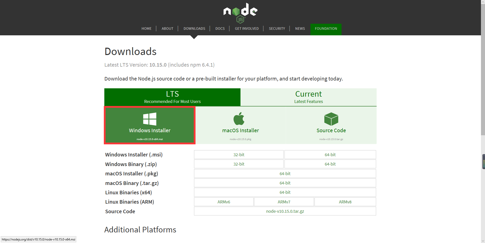

# Vue.js 学习

[TOC]

## 1, 搭建Vue.js环境

首先下载官网下载nodejs



附带了npm的下载

1. npm: Nodejs下的包管理器。由于国内使用npm会很慢,这里推荐使用淘宝NPM镜像（http://npm.taobao.org/） 
$ npm install -g cnpm –registry=https://registry.npm.taobao.org

**后面所有的npm命令都可以用cnpm命令代替会快一点，下面还没改**

2. 由于有些npm有些资源被屏蔽或者是国外资源的原因，经常会导致用npm安装依赖包的时候失败，所有我还需要npm的国内镜像—cnpm。
在命令行中输入 npm install -g cnpm –registry=http://registry.npm.taobao.org 然后等待。完成之后，我们就可以用cnpm代替npm来安装依赖包了

3. 安装vue-cli脚手架构建工具
在命令行中运行命令 npm install -g vue-cli ，然后等待安装完成。

### 初始化项目

通过`vue init webpack firstVue`可以在命令行中初始化一个vue项目

这个时候package.json中的包都还没有安装。可以通过cnpm install安装

安装完成之后，会在我们的项目目录firstVue文件夹中多出一个node_modules文件夹，这里边就是我们项目需要的依赖包资源。 

### 运行项目

热加载运行项目`npm run dev`

[一个部署相关的博客](http://www.cnblogs.com/hi-shepherd/p/6662348.html)

一个不用代理的路径

[Vue chrome 插件下载](https://chrome-extension-downloader.com/)

稳定、快速、免费的前端开源项目 CDN 加速服务

[BootCDN](https://www.bootcdn.cn/)

****

vue基础语法略过，详情官网文档

****

## vue-router

通过vue建立项目，项目结构如下


其中Test.vue是后面添加的

```html
<!-- Test.vue -->
<template>
	<div>
		<h1>This is a test part!!!</h1>
		<button type="button" @click="add">添加</button>
	</div>
</template>

<script>
	export default {
		name : 'Test',
		data() {
			return {
				
			};
		},
		methods: {
			add() {
				console.log('test add')
			}
		}
	}
</script>

<style>

</style>
```

```js
//router.js
import Vue from 'vue'
import Router from 'vue-router'
import Home from './views/Home.vue'
import Test from './views/Test.vue' //修改1

Vue.use(Router)

export default new Router({
  routes: [
    {
      path: '/',
      name: 'home',
      component: Home
    },
    {
      path: '/about',
      name: 'about',
      // route level code-splitting
      // this generates a separate chunk (about.[hash].js) for this route
      // which is lazy-loaded when the route is visited.
      component: () => import(/* webpackChunkName: "about" */ './views/About.vue')
    }, 
    {	//修改2
      path: '/test',
      name: 'test',
      // route level code-splitting
      // this generates a separate chunk (about.[hash].js) for this route
      // which is lazy-loaded when the route is visited.
      component: () => import(/* webpackChunkName: "about" */ './views/Test.vue')
    }, 
  ]
})
```

在App.vue中添加 router-link 。这样组件放到了模板上

```html
<template>
  <div id="app">
    <div id="nav">
      <router-link to="/">Home</router-link> |
      <router-link to="/about">About</router-link> | 
	  <router-link to="/test">Test</router-link>
    </div>
    <router-view/>
  </div>
</template>
```


****

## vuex

一种两个组件访问共有js的属性的方法

```html
// About.vue
<script>
	import store from '@/store'
	export default {
		name: 'about',
		data() {
			return {
				msg : store.state.count
			}
		}
	}
</script>
```

```html
//Test.vue
<script>
    // @表示根目录
	import store from '@/store'
	export default {
		name : 'Test',
		data () {
			return { msg: 'hello' }
		},
		methods: {
			add() {
				console.log('test add')
                // 控制共有js中的函数
				store.commit('increase')
			}
		},
	}
</script>
```

```js
// store.js
import Vue from 'vue'
import Vuex from 'vuex'

Vue.use(Vuex)

export default new Vuex.Store({
  state: {
		count : 0
  },
  mutations: {
		increase() {
			this.state.count++;
		}
  },
  actions: {

  }
})
```