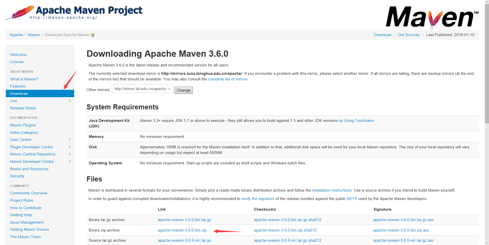

# Maven learning note (0)

[TOC]

## 0, maven 存在的意义

1.1、假如你正在Eclipse下开发两个Java项目，姑且把它们称为A、B，其中A项目中的一些功能依赖于B项目中的某些类，那么如何维系这种依赖关系的呢？

很简单，这不就是跟我们之前写程序时一样吗，需要用哪个项目中的哪些类，也就是用别人写好了的功能代码，导入jar包即可。所以这里也如此，可以将B项目打成jar包，然后在A项目的Library下导入B的jar文件，这样，A项目就可以调用B项目中的某些类了。

这样做几种缺陷,如果在开发过程中，发现B中的bug，则必须将B项目修改好，并重新将B打包并对A项目进行重编译操作,在完成A项目的开发后，为了保证A的正常运行，就需要依赖B(就像在使用某个jar包时必须依赖另外一个jar一样)，两种解决方案，第一种，选择将B打包入A中，第二种，将B也发布出去，等别人需要用A时，告诉开发者，想要用A就必须在导入Bjar包。两个都很麻烦，前者可能造成资源的浪费(比如，开发者可能正在开发依赖B的其它项目，B已经存储到本地了，在导入A的jar包的话，就有了两个B的jar)，后者是我们常遇到的，找各种jar包，非常麻烦(有了maven就不一样了)
 
1.2、我们开发一个项目，或者做一个小demo，比如用SSH框架，那么我们就必须将SSH框架所用的几十个依赖的jar包依次找出来并手动导入，超级繁琐。　
　　　　
上面两个问题的描述，其实都属于项目与项目之间依赖的问题[A项目使用SSH的所有jar，就说A项目依赖SSH]，人为手动的去解决，很繁琐，也不方便，所以使用maven来帮我们管理

so

**Maven是基于项目对象模型(POM project object model)，可以通过一小段描述信息（配置）来管理项目的构建，报告和文档的软件项目管理工具**

## 1, maven 的安装

**official website:http://maven.apache.org/**



1. 安装后设置环境变量 %M2_HOME% 为刚刚的文件目录
2. 添加环境变量路径，刚刚安装目录下的bin文件夹, 在cmd下mvn -v查看测试安装是否成功

```dos
C:\Users\cwl>mvn -v
Apache Maven 3.6.0 (97c98ec64a1fdfee7767ce5ffb20918da4f719f3; 2018-10-25T02:41:47+08:00)
Maven home: F:\maven_learn\lib\apache-maven-3.6.0-bin\apache-maven-3.6.0\bin\..
Java version: 1.8.0_191, vendor: Oracle Corporation, runtime: C:\Program Files\Java\jdk1.8.0_191\jre
Default locale: zh_CN, platform encoding: GBK
OS name: "windows 10", version: "10.0", arch: "amd64", family: "windows"
```

## 2, maven 初步

[官方教程](http://maven.apache.org/guides/getting-started/maven-in-five-minutes.html)

### maven 目录结构

    my-app
    |-- pom.xml
    `-- src
        |-- main
        |   `-- java
        |       `-- com
        |           `-- mycompany
        |               `-- app
        |                   `-- App.java
        `-- test
            `-- java
                `-- com
                    `-- mycompany
                        `-- app
                            `-- AppTest.java

### maven 的 pom.xml

核心配置文件,在该目录下的 pom.xml, 在boot的jar里面

`plexus-classworlds-2.5.2.jar\META-INF\maven\org.codehaus.plexus\plexus-classworlds`

默认的pom.xml东西比较多，官方上有一个简单的模板

```xml
<project xmlns="http://maven.apache.org/POM/4.0.0" xmlns:xsi="http://www.w3.org/2001/XMLSchema-instance"
  xsi:schemaLocation="http://maven.apache.org/POM/4.0.0 http://maven.apache.org/xsd/maven-4.0.0.xsd">
  <modelVersion>4.0.0</modelVersion>
 
  <groupId>com.mycompany.app</groupId>
  <artifactId>my-app</artifactId>
  <version>1.0-SNAPSHOT</version>
 
  <properties>
    <maven.compiler.source>1.7</maven.compiler.source>
    <maven.compiler.target>1.7</maven.compiler.target>
  </properties>
 
  <dependencies>
    <dependency>
      <groupId>junit</groupId>  //包名
      <artifactId>junit</artifactId>    //项目名
      <version>4.12</version>
      <scope>test</scope>
    </dependency>
  </dependencies>
</project>
```

### maven 仓库

maven会在本地`C:\Users\cwl\.m2` 用户目录下创建一个本地仓库，存一些jar包

可以在在`$MAVEN_HOME/conf/setting.xml`里面修改,我们可以在里面找到如下说明

另外还有第三方仓库，中央仓库等概念，这里先不提。

```xml
  <!-- localRepository
   | The path to the local repository maven will use to store artifacts.
   |
   | Default: ${user.home}/.m2/repository
  <localRepository>/path/to/local/repo</localRepository>
  -->
```
### 下面是一个 maven 运行一个基础程序的例子

首先建立如下目录的文件夹


```xml
// pom.xml
<project xmlns="http://maven.apache.org/POM/4.0.0" xmlns:xsi="http://www.w3.org/2001/XMLSchema-instance"
  xsi:schemaLocation="http://maven.apache.org/POM/4.0.0 http://maven.apache.org/xsd/maven-4.0.0.xsd">
  <modelVersion>4.0.0</modelVersion>
 
  <groupId>com.imooc.maven01</groupId>
  <artifactId>maven01-model</artifactId>
  <version>0.0.1-SNAPSHOT</version>
 
  <dependencies>
    <dependency>
        <groupId>junit</groupId>
        <artifactId>junit</artifactId>
        <version>4.12</version>
    </dependency>
  </dependencies>
</project>
```

文件夹结构要与包结构一致, 注意pom.xml和src目录同级

pom.xml与src在同一目录下，然后在src, pom.xml 目录下打开cmd

输入 `mvn compile` 执行编译命令

第一次会下载很多依赖的包, 要等一等


输入 `mvn test` 会执行测试用例

发现编译的错误会在test的时候输出, 少了分号


修改测试成功后


输入 `mvn package` 会打包一个jar包

和src目录同级别的jar包

## maven 常用命令

`mvn compile // 编译`

`mvn test // 测试运行`

`mvn package // 打包成jar包`

`mvn clean //清除刚刚生成的文件`


`mvn install //建jar包发布到本地仓库中`

详情可以在生成信息中查看


`mvn archetype:generate // 创建目录向导` 