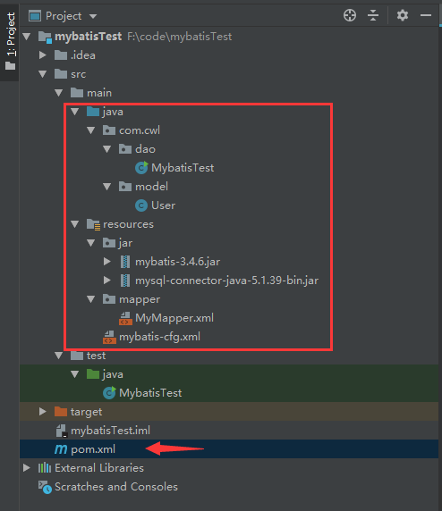

# mybatis note

[TOC]

## a simple jdbc example

```java
package cwl.mysql.jdbc;

import java.sql.Statement;
import java.util.UUID;
import java.sql.*;

public class Main {

    // JDBC 驱动名及数据库 URL
    static final String JDBC_DRIVER = "com.mysql.jdbc.Driver";  
    static final String DB_URL = "jdbc:mysql://localhost:3306/test";
	
    // 数据库的用户名与密码，需要根据自己的设置
    static final String USER = "root";
    static final String PASS = "1143316492";
    
	public static void main(String[] args) {
		
		Connection conn = null;
        Statement stmt = null;
        try{
            // 注册 JDBC 驱动
            Class.forName("com.mysql.jdbc.Driver");
        
            // 打开链接
            System.out.println("连接数据库...");
            conn = DriverManager.getConnection(DB_URL, USER, PASS);
        
            // 执行查询
            stmt = conn.createStatement();
            String sql = "select * from message;";
            ResultSet rs = stmt.executeQuery(sql);
        
            while(rs.next()) {
                String msg = rs.getString("msg");
                System.out.println(msg);
            }
            rs.close();
            stmt.close();
            conn.close();
        } catch (Exception e) {
            e.printStackTrace();
            System.exit(0);
        }
        System.out.println("success");

	}

}

```

## 创建测试数据库

ps: 下面user_name字段会出现问题，默认数据库字段和实体的变量名称应该是相同的，不相同需要设置resultMap, 可以就这么建，加深对result map的理解

```sql
CREATE DATABASE ssmdemo;

use ssmdemo;

DROP TABLE IF EXISTS tb_user;

CREATE TABLE tb_user (
id varchar(32) NOT NULL,
user_name varchar(32) DEFAULT NULL,
password varchar(32) DEFAULT NULL,
name varchar(32) DEFAULT NULL,
age int(10) DEFAULT NULL,
sex int(2) DEFAULT NULL,
birthday date DEFAULT NULL,
created datetime DEFAULT NULL,
updated datetime DEFAULT NULL,
PRIMARY KEY (id)
) ENGINE=InnoDB DEFAULT CHARSET=utf8;


INSERT INTO ssmdemo.tb_user (id, user_name, password, name, age, sex, birthday, created, updated) VALUES ( 'AAA', 'zpc', '123456', '鹏程', '22', '1', '1990-09-02', sysdate(), sysdate());
INSERT INTO ssmdemo.tb_user (id, user_name, password, name, age, sex, birthday, created, updated) VALUES ( 'BBB', 'hj', '123456', '静静', '22', '1', '1993-09-05', sysdate(), sysdate());

```

## 具体步骤

1，在IDEA下建立maven 的 java project

目录结构如下



代码细节

```java

/**
    User 是一个实体类，用于与数据库的映射， 创建set和get方法
*/

package com.cwl.model;

import java.text.SimpleDateFormat;
import java.util.Date;

public class User {
    private String id;
    private String userName;
    private String password;
    private String name;
    private Integer age;
    private Integer sex;
    private Date birthday;
    private String created;
    private String updated;

    public String getId() {
        return id;
    }

    public void setId(String id) {
        this.id = id;
    }

    public String getUserName() {
        return userName;
    }

    public void setUserName(String userName) {
        this.userName = userName;
    }

    public String getPassword() {
        return password;
    }

    public void setPassword(String password) {
        this.password = password;
    }

    public String getName() {
        return name;
    }

    public void setName(String name) {
        this.name = name;
    }

    public Integer getAge() {
        return age;
    }

    public void setAge(Integer age) {
        this.age = age;
    }

    public Integer getSex() {
        return sex;
    }

    public void setSex(Integer sex) {
        this.sex = sex;
    }

    public Date getBirthday() {
        return birthday;
    }

    public void setBirthday(Date birthday) {
        this.birthday = birthday;
    }

    public String getCreated() {
        return created;
    }

    public void setCreated(String created) {
        this.created = created;
    }

    public String getUpdated() {
        return updated;
    }

    public void setUpdated(String updated) {
        this.updated = updated;
    }

    @Override
    public String toString() {
        return "User{" +
                "id='" + id + '\'' +
                ", userName='" + userName + '\'' +
                ", password='" + password + '\'' +
                ", name='" + name + '\'' +
                ", age=" + age +
                ", sex=" + sex +
                ", birthday='" + new SimpleDateFormat("yyyy-MM-dd").format(birthday) + '\'' +
                ", created='" + created + '\'' +
                ", updated='" + updated + '\'' +
                '}';
    }
}
```

```java


```java
/**
    MybatisTest 是一个测试数据库连接类。
    resource是recourse目录下链接到了 xml 配置文件

*/
package com.cwl.dao;

import com.cwl.model.User;
import org.apache.ibatis.io.Resources;
import org.apache.ibatis.session.SqlSession;
import org.apache.ibatis.session.SqlSessionFactory;
import org.apache.ibatis.session.SqlSessionFactoryBuilder;

import java.io.InputStream;

public class MybatisTest {

    public static void main(String[] args) throws Exception {
        // 指定全局配置文件
        String resource = "mybatis-cfg.xml";
        // 读取配置文件
        InputStream inputStream = Resources.getResourceAsStream(resource);
        // 构建sqlSessionFactory
        SqlSessionFactory sqlSessionFactory = new SqlSessionFactoryBuilder().build(inputStream);
        // 获取sqlSession
        SqlSession sqlSession = sqlSessionFactory.openSession();
        try {
            // 操作CRUD，第一个参数：指定statement，规则：命名空间+“.”+statementId
            // ps CRUD 是一个数据操作的缩写
            // 在xml下定义的id
            // 第二个参数：指定传入sql的参数：这里是用户id
            User user = sqlSession.selectOne("MyMapper.selectUser", 1);
            System.out.println(user + "\n");
        } finally {
            sqlSession.close();
        }
    }
}
```

```xml

/**
    java语句链接到了数据库的xml，下面是配置的驱动，账号密码等。
    mybatis.cfg.xml
*/
<?xml version="1.0" encoding="UTF-8" ?>
<!DOCTYPE configuration
        PUBLIC "-//mybatis.org//DTD Config 3.0//EN"
        "http://mybatis.org/dtd/mybatis-3-config.dtd">
<!-- 根标签 -->
<configuration>
    <!-- 环境，可以配置多个，default：指定采用哪个环境 -->
    <environments default="test">
        <!-- id：唯一标识 -->
        <environment id="test">
            <!-- 事务管理器，JDBC类型的事务管理器 -->
            <transactionManager type="JDBC" />
            <!-- 数据源，池类型的数据源 -->
            <dataSource type="POOLED">
                <property name="driver" value="com.mysql.jdbc.Driver" />
                <property name="url" value="jdbc:mysql://127.0.0.1:3306/ssmdemo" />
                <property name="username" value="root" />
                <property name="password" value="1143316492" />
            </dataSource>
        </environment>
    </environments>
    <!-- 这里链接到一个select的映射 -->
    <mappers>
        <mapper resource="mapper/MyMapper.xml" />
    </mappers>
</configuration>
```

```xml
/**
    MyMapper.xml 是一个配置文件
*/

<?xml version="1.0" encoding="UTF-8" ?>
<!DOCTYPE mapper
        PUBLIC "-//mybatis.org//DTD Mapper 3.0//EN"
        "http://mybatis.org/dtd/mybatis-3-mapper.dtd">
<!-- mapper:根标签，namespace：命名空间，随便写，一般保证命名空间唯一 -->
<mapper namespace="MyMapper">
    <!-- statement，内容：sql语句。id：唯一标识，随便写，在同一个命名空间下保持唯一，给jav代码调用的凭证
       resultType: sql语句查询结果集的封装类型,tb_user即为数据库中的表
       resultMap: 是一个映射关系如果默认映射失败的话需要补充
     -->
    <select id="selectUser" resultType="com.cwl.model.User" resultMap="UserResultMap">
      select * from tb_user where id = 'BBB'
   </select>

    <resultMap id="UserResultMap" type="com.cwl.model.User">
        <!-- id 代表主键 -->
        <!-- result 代表普通属性 -->
        <!-- property 代表实体类的属性， column 是数据库中属性名 -->
        <!--
            不写默认映射如果实体类的名和数据库属性名不一样会获取不到，
            案例是下面的userName, 数据库中是user_name
        -->
        <id property="id" column="id"></id>
        <result property="userName" column="user_name"></result>
        <result property="password" column="password"></result>
        <result property="name" column="name"></result>
        <result property="age" column="age"></result>
        <result property="sex" column="sex"></result>
        <result property="birthday" column="birthday"></result>
        <result property="created" column="created"></result>
        <result property="update" column="update"></result>
    </resultMap>

</mapper>

```

## 配置增删查改功能。

一个测试类和xml文件即可使用mybatis进行增删查改功能

```java

import com.cwl.dao.UserDaoImpl;
import com.cwl.model.User;
import org.apache.ibatis.io.Resources;
import org.apache.ibatis.session.SqlSession;
import org.apache.ibatis.session.SqlSessionFactory;
import org.apache.ibatis.session.SqlSessionFactoryBuilder;

import java.io.InputStream;
import java.util.Date;

public class MybatisTest {

    public static void testMybatisSelect() throws Exception {
        // 指定全局配置文件
        String resource = "mybatis-cfg.xml";
        // 读取配置文件
        InputStream inputStream = Resources.getResourceAsStream(resource);
        // 构建sqlSessionFactory
        SqlSessionFactory sqlSessionFactory = new SqlSessionFactoryBuilder().build(inputStream);
        // 获取sqlSession
        SqlSession sqlSession = sqlSessionFactory.openSession();


        try {

            UserDaoImpl userDao = new UserDaoImpl(sqlSession);

            // 测试查询一个值
            //System.out.println(userDao.queryByUserID("BBB"));

            // 测试查询多个值

//            List<User> list = userDao.queryUserAll();
//            for(User user: list) {
//                System.out.println(user);
//            }

            // 测试添加
            User user = new User();
            user.setId("CCC");
            user.setAge(16);
            user.setBirthday(new Date("1990/09/02"));
            user.setName("大鹏");
            user.setPassword("123456");
            user.setSex(1);
            user.setUserName("evan");

//            userDao.insertUser(user);
//            sqlSession.commit();

            // 测试删除

//            userDao.deleteUser("CCC");
//            userDao.sqlSession.commit();

            // 测试修改

            user.setName("hello");
            userDao.updateUser(user);
            userDao.sqlSession.commit();

        } finally {
            sqlSession.close();
        }
    }


    public static void main(String[] args) throws Exception {
        testMybatisSelect();
    }

}

```

```xml
<?xml version="1.0" encoding="UTF-8" ?>
<!DOCTYPE mapper
        PUBLIC "-//mybatis.org//DTD Mapper 3.0//EN"
        "http://mybatis.org/dtd/mybatis-3-mapper.dtd">
<!-- mapper:根标签，namespace：命名空间，随便写，一般保证命名空间唯一 -->
<mapper namespace="UserDao">
    <!-- statement，内容：sql语句。id：唯一标识，随便写，在同一个命名空间下保持唯一
       resultType：sql语句查询结果集的封装类型,tb_user即为数据库中的表
     -->
    <!--<select id="queryUserById" resultType="com.zpc.mybatis.pojo.User">-->
    <!--select * from tb_user where id = #{id}-->
    <!--</select>-->

    <!--使用别名-->
    <select id="queryUserById" resultType="com.cwl.model.User">
      select
       tuser.id as id,
       tuser.user_name as userName,
       tuser.password as password,
       tuser.name as name,
       tuser.age as age,
       tuser.birthday as birthday,
       tuser.sex as sex,
       tuser.created as created,
       tuser.updated as updated
       from
       tb_user tuser
       where tuser.id = #{id};
   </select>

    <!-- select all 注意 resultMap的设定-->
    <select id="queryUserAll" resultType="com.cwl.model.User" resultMap="UserResultMap">
        select * from tb_user;
    </select>

    <resultMap id="UserResultMap" type="com.cwl.model.User">
        <id property="id" column="id"></id>
        <result property="userName" column="user_name"></result>
        <result property="password" column="password"></result>
        <result property="name" column="name"></result>
        <result property="age" column="age"></result>
        <result property="sex" column="sex"></result>
        <result property="birthday" column="birthday"></result>
        <result property="created" column="created"></result>
        <result property="update" column="update"></result>
    </resultMap>

    <!--插入数据-->
    <insert id="insertUser" parameterType="com.cwl.model.User">
        INSERT INTO tb_user (
        id,
        user_name,
        password,
        name,
        age,
        sex,
        birthday,
        created,
        updated
        )
        VALUES
        (
        #{id},
        #{userName},
        #{password},
        #{name},
        #{age},
        #{sex},
        #{birthday},
        now(),
        now()
        );
    </insert>

    <update id="updateUser" parameterType="com.cwl.model.User">
        UPDATE tb_user
        <trim prefix="set" suffixOverrides=",">
            <if test="userName!=null">user_name = #{userName},</if>
            <if test="password!=null">password = #{password},</if>
            <if test="name!=null">name = #{name},</if>
            <if test="age!=null">age = #{age},</if>
            <if test="sex!=null">sex = #{sex},</if>
            <if test="birthday!=null">birthday = #{birthday},</if>
            updated = now(),
        </trim>
        WHERE
        (id = #{id});
    </update>

    <delete id="deleteUser">
        delete from tb_user where id=#{id}
    </delete>
</mapper>
```

## 最终的pom.xml

```xml
<?xml version="1.0" encoding="UTF-8"?>
<project xmlns="http://maven.apache.org/POM/4.0.0"
         xmlns:xsi="http://www.w3.org/2001/XMLSchema-instance"
         xsi:schemaLocation="http://maven.apache.org/POM/4.0.0 http://maven.apache.org/xsd/maven-4.0.0.xsd">
    <modelVersion>4.0.0</modelVersion>

    <groupId>com.cwl</groupId>
    <artifactId>mybatisTest</artifactId>
    <version>1.0-SNAPSHOT</version>

    <dependencies>
        <dependency>
            <groupId>junit</groupId>
            <artifactId>junit</artifactId>
            <version>4.12</version>
        </dependency>

        <!--mybatis 依赖 导入jar包后报错消失-->
        <dependency>
            <groupId>org.mybatis</groupId>
            <artifactId>mybatis</artifactId>
            <version>3.4.6</version>
        </dependency>


        <!--mysql 依赖-->
        <dependency>
            <groupId>mysql</groupId>
            <artifactId>mysql-connector-java</artifactId>
            <version>5.1.37</version>
        </dependency>


    </dependencies>

</project>

```

## 总结

首先是一个java文件，调用者

```java
        // 指定全局配置文件
        String resource = "mybatis-cfg.xml";
        // 读取配置文件
        InputStream inputStream = Resources.getResourceAsStream(resource);
        // 构建sqlSessionFactory
        SqlSessionFactory sqlSessionFactory = new SqlSessionFactoryBuilder().build(inputStream);
        // 获取sqlSession
        SqlSession sqlSession = sqlSessionFactory.openSession();
        
        // do somethint

        sqlSession.Close();
```

然后是一个mybatis-config.xml的文件，这里编写所有的数据库相关配置，但是为了项目结构的一些要求，mybatis-config.xml只有数据库连接的相关配置，其他具体细节通过链接弄出来。

也就是

```xml
<mappers>
    <mapper resource="mapper/MyMapper.xml" />
</mappers>
```

```xml
    <!-- MyMapper.xml -->
    <!-- statement，内容：sql语句。id：唯一标识，随便写，在同一个命名空间下保持唯一，给jav代码调用的凭证
       resultType: sql语句查询结果集的封装类型,tb_user即为数据库中的表
       resultMap: 是一个映射关系如果默认映射失败的话需要补充
     -->
    <select id="selectUser" resultType="com.cwl.model.User" resultMap="UserResultMap">
      select * from tb_user where id = 'BBB'
   </select>

    <resultMap id="UserResultMap" type="com.cwl.model.User">
        <!-- id 代表主键 -->
        <!-- result 代表普通属性 -->
        <!-- property 代表实体类的属性， column 是数据库中属性名 -->
        <!--
            不写默认映射如果实体类的名和数据库属性名不一样会获取不到，
            案例是下面的userName, 数据库中是user_name
        -->
        <id property="id" column="id"></id>
        <result property="userName" column="user_name"></result>
        <result property="password" column="password"></result>
        <result property="name" column="name"></result>
        <result property="age" column="age"></result>
        <result property="sex" column="sex"></result>
        <result property="birthday" column="birthday"></result>
        <result property="created" column="created"></result>
        <result property="update" column="update"></result>
    </resultMap>

```

mapper.xml 中是 sql语句，通过resultType来制定java类和数据库属性关联，如果名字相似度高则自动关联，否则需要通过resultMap确定映射关系。

