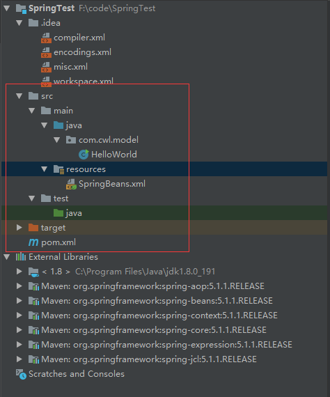

# spring note

[TOC]

[第一个spring](https://www.shiyanlou.com/courses/578)

## spring 入门

1，通过默认 maven 创建项目，pom.xml配置如下, 然后等待加载包，默认建的是 maven 项目，没有添加 spring依赖

```xml
<?xml version="1.0" encoding="UTF-8"?>
<project xmlns="http://maven.apache.org/POM/4.0.0"
         xmlns:xsi="http://www.w3.org/2001/XMLSchema-instance"
         xsi:schemaLocation="http://maven.apache.org/POM/4.0.0 http://maven.apache.org/xsd/maven-4.0.0.xsd">
    <modelVersion>4.0.0</modelVersion>

    <groupId>com.cwl</groupId>
    <artifactId>SpringTest</artifactId>
    <version>1.0-SNAPSHOT</version>

    <name>bean</name>

    <properties>
        <project.build.sourceEncoding>UTF-8</project.build.sourceEncoding>
        <maven.compiler.source>1.8</maven.compiler.source>
        <maven.compiler.target>1.8</maven.compiler.target>
        <spring.version>5.1.1.RELEASE</spring.version>
    </properties>

    <dependencies>
        <dependency>
            <groupId>org.springframework</groupId>
            <artifactId>spring-core</artifactId>
            <version>5.1.1.RELEASE</version>
        </dependency>
        <dependency>
            <groupId>org.springframework</groupId>
            <artifactId>spring-context</artifactId>
            <version>5.1.1.RELEASE</version>
        </dependency>
    </dependencies>
</project>
```

2，java代码部分

```java
package com.cwl.model;

import org.springframework.context.ApplicationContext;
import org.springframework.context.support.ClassPathXmlApplicationContext;

public class HelloWorld {
    private String name;

    public String getName() {
        return name;
    }

    public void setName(String name) {
        this.name = name;
    }

    public static void main(String[] args) {
        ApplicationContext context = new ClassPathXmlApplicationContext("SpringBeans.xml");
        HelloWorld obj = (HelloWorld) context.getBean("helloBean");
        String name = obj.getName();
        System.out.println(name);
    }
}
```

3, xml 配置部分

```xml
<?xml version="1.0" encoding="UTF-8"?>
<beans xmlns="http://www.springframework.org/schema/beans"
       xmlns:xsi="http://www.w3.org/2001/XMLSchema-instance"
       xsi:schemaLocation="http://www.springframework.org/schema/beans http://www.springframework.org/schema/beans/spring-beans.xsd">
    <bean id="helloBean" class="com.cwl.model.HelloWorld">
        <property name="name" value="hello world"/>
    </bean>
</beans>
```

项目结构如下图



通过xml的配置，可以使得一定的修改属性只需要修改xml，而不需要修改java代码重新编译

***

另外的 xml bean 的例子

```xml
    <bean id="FileNameGenerator" class="com.shiyanlou.spring.bean.FileNameGenerator">
        <property name="name">
            <value>shiyanlou</value>
        </property>
        <property name="type">
            <value>txt</value>
        </property>
    </bean>
    <!-- 另一重配置方法 缩写方法-->
    <!-- 
        <bean id="FileNameGenerator" class="com.shiyanlou.spring.bean.FileNameGenerator">
               <property name="name" value="shiyanlou" />
               <property name="type" value="txt" />
           </bean>
     -->
     <!-- p 的配置方法 -->
     <bean id="FileNameGenerator" class="com.shiyanlou.spring.bean.FileNameGenerator"
        p:name="shiyanlou" p:type="txt" />
     <!-- 
      需要在bean的xml中声明
      xmlns:p="http://www.springframework.org/schema/p"
      -->
```

### 嵌套的bean

例如有下面两个类，我们可以看到Customer类中有Person类，那么bean的例子如下

```java
//person.java
public class Person {
    private String name;
    private String address;
    private int age;

    public String getName() {
        return name;
    }

    public void setName(String name) {
        this.name = name;
    }

    public String getAddress() {
        return address;
    }

    public void setAddress(String address) {
        this.address = address;
    }

    public int getAge() {
        return age;
    }

    public void setAge(int age) {
        this.age = age;
    }

    @Override
    public String toString() {
        return "Person [address=" + address + ", age=" + age + ", name=" + name + "]";
    }  
}
```

```java
//Customer.java
public class Customer {
         private Person person;
        //带参构造方法
        public Customer(Person person) {
            this.person = person;
        }
        //有带参构造方法一定要有默认构造方法
        public Customer(){}

        public void setPerson(Person person) {
            this.person = person;
        }

        @Override
        public String toString() {
            return "Customer [person=" + person + "]";
        }
}
```

在这种情况下，bean的边下有如下一种方案

1, 通过ref 进行链接

```xml
    <bean id="CustomerBean" class="com.shiyanlou.spring.innerbean.Customer">
        <property name="person" ref="PersonBean" />
    </bean>

    <bean id="PersonBean" class="com.shiyanlou.spring.innerbean.Person">
        <property name="name" value="shiyanlou" />
        <property name="address" value="chengdu" />
        <property name="age" value="25" />
    </bean>
```

2，声明内部bean

```xml
 <bean id="CustomerBean" class="com.shiyanlou.spring.innerbean.Customer">
        <property name="person">
            <bean class="com.shiyanlou.spring.innerbean.Person">
                <property name="name" value="shiyanlou" />
                <property name="address" value="chengdu" />
                <property name="age" value="25" />
            </bean>
        </property>
  </bean>
```

3, 通过构造函数注入

```xml
 <bean id="CustomerBean" class="com.shiyanlou.spring.innerbean.Customer">
     <constructor-arg>
         <bean class="com.shiyanlou.spring.innerbean.Person">
             <property name="name" value="shiyanlou" />
             <property name="address" value="chengdu" />
             <property name="age" value="25" />
         </bean>
     </constructor-arg>
 </bean>
```

## spring的作用域

在 Spring 中，Bean 的作用域决定了从 Spring 容器中返回的 Bean 实例的类型。在 Spring 中，支持以下 5 种类型的作用域：

1. singleton — 单例模式，由 IOC 容器返回一个唯一的 bean 实例。

2. prototype — 原型模式，被请求时，每次返回一个新的 bean 实例。

3. request — 每个 HTTP Request 请求返回一个唯一的 Bean 实例。

4. session — 每个 HTTP Session 返回一个唯一的 Bean 实例。

5. globalSession — Http Session 全局 Bean 实例。

    注：大多数情况下，你可能只需要处理 Spring 的核心作用域 — 单例模式（ singleton ）和原型模式（ prototype ），默认情况下，作用域是单例模式。

## 集合的bean

假设有如下Customer类

```java
public class Customer {

        private List<Object> lists ;//这里的lists要和Bean中property标签的name一样。详见本段代码下的注释。
        private Set<Object> sets ;
        private Map<Object, Object> maps ;
        private Properties pros;

        public List<Object> getLists() {
            return lists;
        }
        public void setLists(List<Object> lists) {
            this.lists = lists;
        }
        public Set<Object> getSets() {
            return sets;
        }
        public void setSets(Set<Object> sets) {
            this.sets = sets;
        }
        public Map<Object, Object> getMaps() {
            return maps;
        }
        public void setMaps(Map<Object, Object> maps) {
            this.maps = maps;
        }
        public Properties getPros() {
            return pros;
        }
        public void setPros(Properties pros) {
            this.pros = pros;
        }

        private Person person;//不要忘记写内部要引用的 Bean 

        public Customer(Person person) {
            this.person = person;
        }

        public Customer(){}

        public void setPerson(Person person) {
            this.person = person;
        }

        @Override
        public String toString() {
            return "Customer [person=" + person + "]";
        }
}
```

需要配置的xml如下

```xml
<?xml version="1.0" encoding="UTF-8"?>
<beans xmlns="http://www.springframework.org/schema/beans"
    xmlns:xsi="http://www.w3.org/2001/XMLSchema-instance"
    xsi:schemaLocation="http://www.springframework.org/schema/beans
    http://www.springframework.org/schema/beans/spring-beans.xsd">

    <!--bean的 id 最好首字母小写 -->
    <bean id="customerBean" class="com.shiyanlou.spring.collections.Customer">

        <!-- java.util.List -->
        <property name="lists">
            <list>
                <value>1</value><!-- List 属性既可以通过 <value> 注入字符串，也可以通过 <ref> 注入容器中其他的 Bean-->
                 <ref bean="personBean" />
                 <value>2</value>
                <bean class="com.shiyanlou.spring.collections.Person">
                    <property name="name" value="shiyanlouList" />
                    <property name="address" value="chengdu" />
                    <property name="age" value="25" />
                </bean>
            </list>
        </property>

        <!-- java.util.Set -->
        <property name="sets">
            <set>
                <value>1</value><!--Set 与 List 类似-->
                <ref bean="personBean" />
                <bean class="com.shiyanlou.spring.collections.Person">
                    <property name="name" value="shiyanlouSet" />
                    <property name="address" value="chengdu" />
                    <property name="age" value="25" />
                </bean>
            </set>
        </property>

        <!-- java.util.Map -->
        <property name="maps">
            <map>
                <entry key="Key 1" value="1" /><!--一个 entry 就是一个 Map 元素-->
                <entry key="Key 2" value-ref="personBean" />
                <entry key="Key 3">
                    <bean class="com.shiyanlou.spring.collections.Person">
                        <property name="name" value="shiyanlouMap" />
                           <property name="address" value="chengdu" />
                        <property name="age" value="25" />
                    </bean>
                </entry>
            </map>
        </property>    

        <!-- java.util.Properties -->
        <property name="pros"><!-- Properties 类型类似于Map 类型的特例，Map 元素的键值可以对应任何类型的对象，但是Properties只能是字符串-->
            <props>
                <prop key="admin">admin@nospam.com</prop>
                <prop key="support">support@nospam.com</prop>
            </props>
        </property>
    </bean>

    <bean id="personBean" class="com.shiyanlou.spring.collections.Person">
        <property name="name" value="shiyanlouPersonBean" />
        <property name="address" value="chengdu" />
        <property name="age" value="25" />
    </bean>
</beans>
```

## spring注解

```java
@Component("shiyanlou")
public class shiyanlou{

}
```
该注解会自动生成bean
与xml下
```xml
<bean id="shiyanlou" class="com.shiyanlou.spring.shiyanlou">
```
效果相同

    @Controller:对应表现层的 Bean，也就是 Action 。
    @Service:对应的是业务层 Bean 。
    @Repository:对应数据访问层 Bean 。

#### @Autowired
@Autowired 可以用来装配 bean，都可以写在字段上，或者方法上。使用 @Autowired，首先要在在 applicationContext.xml 中加入

```xml
<bean class="org.springframework.beans.factory.annotation.AutowiredAnnotationBeanPostProcessor"/>
```

@Autowired 默认按类型装配，默认情况下必须要求依赖对象必须存在，如果要允许 null 值，可以设置它的 required 属性为 false 。例如：

```java
@Autowired() 
@Qualifier("shiyanlouDao")
private ShiyanlouDao shiyanlouDao;
```

#### @Configuration
通过使用注释 @Configuration 告诉 Spring ，这个 Class 是 Spring 的核心配置文件，并且通过使用注释 @Bean 定义 bean ，举例说明：package com.shiyanlou.spring.java_config;

```java
import org.springframework.context.annotation.Bean;
import org.springframework.context.annotation.Configuration;

@Configuration
public class AppConfig {

    @Bean(name="animal")
    public IAnimal getAnimal(){
        return new Dog();
    }
}
```

App.java 内容：
```java
package com.shiyanlou.spring.java_config;

import org.springframework.context.ApplicationContext;
import org.springframework.context.annotation.AnnotationConfigApplicationContext;

public class App {

    private static ApplicationContext context;

    public static void main(String[] args) {
        context = new AnnotationConfigApplicationContext(AppConfig.class);
        IAnimal obj = (IAnimal) context.getBean("animal");
        obj.makeSound();

    }

}
```
在 ApplicationContext.xml 文件中只需要添加：

```xml
<bean id="animal" class="com.shiyanlou.spring.java_config.Dog">
```

***

## spring 的自动扫描

首先我们有一个类

```java
import org.springframework.stereotype.Component;
@Component //@Repository
public class CustomerDAO 
{
    @Override
    public String toString() {
        return "Hello , This is CustomerDAO";
    }    
}
```

然后我们有一个嵌套类

```java
import org.springframework.beans.factory.annotation.Autowired;
import org.springframework.stereotype.Component;

import com.shiyanlou.spring.dao.CustomerDAO;

@Component // @Service
public class CustomerService 
{
    @Autowired
    CustomerDAO customerDAO;

    @Override
    public String toString() {
        return "CustomerService [customerDAO=" + customerDAO + "]";
    }
}

```

我们的pom.xml 改成这样

```xml
<?xml version="1.0" encoding="UTF-8"?>
<beans xmlns="http://www.springframework.org/schema/beans"
       xmlns:xsi="http://www.w3.org/2001/XMLSchema-instance"
       xmlns:context="http://www.springframework.org/schema/context"
       xsi:schemaLocation="
            http://www.springframework.org/schema/context
            http://www.springframework.org/schema/context/spring-context.xsd
            http://www.springframework.org/schema/beans 
            http://www.springframework.org/schema/beans/spring-beans.xsd">

    <context:component-scan base-package="com.shiyanlou.spring"/>

</beans>
```

    注意：以上 xml 文件中，加入了 context:component-scan 标签，beans 中也加入了标签，这样就将 Spring 的自动扫描特性引入， base-package 表示组件的存放位置，Spring 将扫描对应文件夹下的 bean（用 @Component 注释过的），将这些 bean 注册到容器中。

    在项目中，我们可以将所有自动扫描组件都用 @Component 注释，Spring 将会扫描所有用 @Component 注释过得组件。 实际上，@Repository 、 @Service 、 @Controller 三种注释是为了加强代码的阅读性而创造的，可以在不同的应用层中，用不同的注释,
    上面 // 后面的是更准确的标注

运行效果与手动配置效果一样

```xml
    <bean id="customerService" class="com.shiyanlou.spring.services.CustomerService">
        <property name="customerDAO" ref="customerDAO" />
    </bean>

    <bean id="customerDAO" class="com.shiyanlou.spring.dao.CustomerDAO" />
```

    有 4 种注释类型，分别是：
    @Component ——表示一个自动扫描 component
    @Repository  ——表示持久化层的 DAO component
    @Service ——表示业务逻辑层的 Service component
    @Controller ——表示表示层的 Controller component

## 自定义注解

默认情况下，Spring 将把组件 Class 的第一个字母变成小写，来作为自动扫描组件的名称，例如将 CustomerService 转变为 customerService ，你可以用 customerService 这个名字调用组件，如下：

```java
CustomerService cust = (CustomerService)context.getBean("customerService");
```
也可以像下面这样，创建自定义的组件名称：
```java
@Service("AAA")
public class CustomerService 
...
```
但是得添加下面的代码：
```java
import org.springframework.stereotype.Service;
```
可以调用自己定义的组件了，如下：
```java
CustomerService cust = (CustomerService)context.getBean("AAA");
```

## 自动装配(*)

[link](https://www.shiyanlou.com/courses/578/labs/1937/document)

***

# 面向切片编程AOP

添加mavn 依赖

    Spring AOP 即 Aspect-oriented programming，面向切面编程，是作为面向对象编程的一种补充，专门用于处理系统中分布于各个模块（不同方法）中的交叉关注点的问题。简单地说，就是一个拦截器（ interceptor ）拦截一些处理过程。例如，当一 个method 被执行，Spring AOP 能够劫持正在运行的 method ，在 method 执行前或者后加入一些额外的功能。在 Spring AOP 中，支持 4 种类型的通知（ Advice ）：
    Before advice - method 执行前通知
    After returning advice - method 返回一个结果后通知
    After throwing advice - method 抛出异常后通知
    Around advice - 环绕通知，结合了以上三种

总结一下过程：

1. 需要一个普通的bean
2. 一个实现了对应接口的bean
3. 劫持bean的配置xml部分，自动或者手动

```xml
<?xml version="1.0" encoding="UTF-8"?>
<project xmlns="http://maven.apache.org/POM/4.0.0" xmlns:xsi="http://www.w3.org/2001/XMLSchema-instance"
         xsi:schemaLocation="http://maven.apache.org/POM/4.0.0 http://maven.apache.org/xsd/maven-4.0.0.xsd">
    <modelVersion>4.0.0</modelVersion>

    <groupId>com.shiyanlou</groupId>
    <artifactId>SpringAop</artifactId>
    <version>1.0-SNAPSHOT</version>

    <name>SpringAop</name>

    <properties>
        <project.build.sourceEncoding>UTF-8</project.build.sourceEncoding>
        <maven.compiler.source>1.8</maven.compiler.source>
        <maven.compiler.target>1.8</maven.compiler.target>
        <spring.version>5.1.1.RELEASE</spring.version>
    </properties>
    <dependencies>
        <dependency>
            <groupId>org.springframework</groupId>
            <artifactId>spring-core</artifactId>
            <version>${spring.version}</version>
        </dependency>
        <dependency>
            <groupId>org.springframework</groupId>
            <artifactId>spring-context</artifactId>
            <version>${spring.version}</version>
        </dependency>
        <dependency>
            <groupId>org.aspectj</groupId>
            <artifactId>aspectjweaver</artifactId>
            <version>1.9.2</version>
        </dependency>
        <dependency>
            <groupId>org.aspectj</groupId>
            <artifactId>aspectjtools</artifactId>
            <version>1.9.2</version>
        </dependency>
        <dependency>
            <groupId>org.aspectj</groupId>
            <artifactId>aspectjrt</artifactId>
            <version>1.9.2</version>
        </dependency>
        <dependency>
            <groupId>cglib</groupId>
            <artifactId>cglib</artifactId>
            <version>3.2.9</version>
        </dependency>
    </dependencies>
</project>
```

我们先有一个类

```java
package com.cwl.model;

public class CustomerService {

    private String name;
    private String url;

    public void setName(String name) {
        this.name = name;
    }

    public void setUrl(String url) {
        this.url = url;
    }

    public void printName() {
        System.out.println("Customer name : " + this.name);
    }

    public void printURL() {
        System.out.println("Customer website : " + this.url);
    }

    public void printThrowException() {
        throw new IllegalArgumentException();
    }

}
```

一个切人函数的类,需要实现MethodBeforeAdvice接口

```java
package com.cwl.aop;

import org.springframework.aop.MethodBeforeAdvice;

import java.lang.reflect.Method;

public class BeforeMethod implements MethodBeforeAdvice {

    public void before(Method method, Object[] objects, Object o) throws Throwable {
        System.out.println("before method");
    }
}
```

对应配置xml

```xml
<?xml version = "1.0" encoding = "UTF-8"?>
<beans xmlns="http://www.springframework.org/schema/beans"
       xmlns:xsi="http://www.w3.org/2001/XMLSchema-instance"
       xsi:schemaLocation="http://www.springframework.org/schema/beans
    http://www.springframework.org/schema/beans/spring-beans.xsd">

    <bean id="customerService" class="com.cwl.model.CustomerService">
        <property name="name" value="Shiyanlou" />
        <property name="url" value="http://shiyanlou.com" />
    </bean>

    <bean id="BeforeMethod" class="com.cwl.aop.BeforeMethod" />

    <!--在配置文件中加入新的 bean 配置 BeforeMethod ，-->
    <!--然后创建一个新的代理（ proxy ），命名为 customerServiceProxy 。-->
    <!--target 定义你想劫持哪个 bean； -->
    <!--interceptorNames 定义想用哪个 class ( advice )劫持 target-->

    <bean id="customerServiceProxy" class="org.springframework.aop.framework.ProxyFactoryBean">
        <property name="target" ref="customerService" />
        <property name="interceptorNames">
            <list>
                <value>BeforeMethod</value>
            </list>
        </property>
    </bean>
</beans>
```

```java
package com.shiyanlou.spring.aop.advice;

import org.springframework.context.ApplicationContext;
import org.springframework.context.support.ClassPathXmlApplicationContext;

public class App {

    public static void main(String[] args) {
        ApplicationContext appContext = new ClassPathXmlApplicationContext(
                new String[] { "SpringAOPAdvice.xml" });

        CustomerService cust = (CustomerService) appContext.getBean("customerService");

        System.out.println("*************************");
        cust.printName();
        System.out.println("*************************");
        cust.printURL();
        System.out.println("*************************");
        try {
            cust.printThrowException();
        } catch (Exception e) {
        }
    }
}

```

**Afetr Throwing Advice**

    目标 method 运行时，抛出 IllegalArgumentException 异常后，运行切入的方法

**Around Advice**

    创建一个实现了接口 MethodInterceptor 的 class ，你必须通过 methodInvocation.proceed() 来调用原来的方法，即通过调用 methodInvocation.proceed() 来调用 CustomerService 中的每一个方法

```java
package com.shiyanlou.spring.aop.advice;

import java.util.Arrays;
import org.aopalliance.intercept.MethodInterceptor;
import org.aopalliance.intercept.MethodInvocation;

public class HijackAroundMethod implements MethodInterceptor {

    public Object invoke(MethodInvocation methodInvocation) throws Throwable {
        System.out.println("Method name : "
                + methodInvocation.getMethod().getName());
        System.out.println("Method arguments : "
                + Arrays.toString(methodInvocation.getArguments()));

        // 相当于  MethodBeforeAdvice
        System.out.println("HijackAroundMethod : Before method hijacked!");

        try {
            // 调用原方法，即调用CustomerService中的方法
            Object result = methodInvocation.proceed();

            // 相当于 AfterReturningAdvice
            System.out.println("HijackAroundMethod : After method hijacked!");

            return result;

        } catch (IllegalArgumentException e) {
            // 相当于 ThrowsAdvice
            System.out.println("HijackAroundMethod : Throw exception hijacked!");
            throw e;
        }
    }

}
```

```xml
<beans xmlns="http://www.springframework.org/schema/beans"
    xmlns:xsi="http://www.w3.org/2001/XMLSchema-instance"
    xsi:schemaLocation="http://www.springframework.org/schema/beans
    http://www.springframework.org/schema/beans/spring-beans.xsd">

    <bean id="customerService" class="com.shiyanlou.spring.aop.advice.CustomerService">
        <property name="name" value="Shiyanlou" />
        <property name="url" value="shiyanlou.com" />
    </bean>

    <bean id="hijackBeforeMethodBean" class="com.shiyanlou.spring.aop.advice.HijackBeforeMethod" />
    <bean id="hijackAfterMethodBean" class="com.shiyanlou.spring.aop.advice.HijackAfterMethod" />
    <bean id="hijackThrowExceptionBean" class="com.shiyanlou.spring.aop.advice.HijackThrowExceptionMethod" />
    <bean id="hijackAroundMethodBean" class="com.shiyanlou.spring.aop.advice.HijackAroundMethod" />

    <bean id="customerServiceProxy" class="org.springframework.aop.framework.ProxyFactoryBean">
        <property name="target" ref="customerService" />
        <property name="interceptorNames"> 
            <list>
                <value>hijackAroundMethodBean</value>
            </list>
        </property>
    </bean>
</beans>
```

    CustomerService 中每一个方法的调用，都会执行 HijackAroundMethod 中的 invoke 方法，可以看到整个切入点将目标 around 。大多数的 Spring 开发者只用 Around Advice ，因为它能够实现所有类型的 Advice 。在实际的项目开发中，我们还是要尽量选择适合的 Advice 。在以上的例子中，CustomerService 中的所有方法都被自动拦截，但是大多数情况下，我们不需要拦截一个 class 中的所有方法，而是拦截符合条件的方法。这时，我们就需要用到 Pointcut and Advice ，即切入点和通知

## AOP Point cut & advisor

    大多情况下，你只需要一个方法去拦截一两个 method 。这样就引入了 Pointcut （切入点）的概念，它允许你根据 method 的名字去拦截指定的 method 。另外，一个 Pointcut 必须结合一个 Advisor 来使用

    在 Spring AOP 中，有 3 个常用的概念，Advices 、 Pointcut 、 Advisor ，解释如下：
    Advices ：表示一个 method 执行前或执行后的动作。
    Pointcut ：表示根据 method 的名字或者正则表达式去拦截一个 method 。
    Advisor ： Advice 和 Pointcut 组成的独立的单元，并且能够传给 proxy factory 对象。

### 使用around advice 的方法劫持

```java
package com.cwl.aop;

//注意不要导错包
import org.aopalliance.intercept.MethodInvocation;
import org.aopalliance.intercept.MethodInterceptor;

import java.util.Arrays;

public class AroundMethod implements MethodInterceptor {

    public Object invoke(MethodInvocation methodInvocation) throws Throwable {
        System.out.println("Method name : "
                + methodInvocation.getMethod().getName());
        System.out.println("Method arguments : "
                + Arrays.toString(methodInvocation.getArguments()));

        // 相当于  MethodBeforeAdvice
        System.out.println("HijackAroundMethod : Before method hijacked!");

        try {
            // 调用原方法，即调用CustomerService中的方法
            Object result = methodInvocation.proceed();

            // 相当于 AfterReturningAdvice
            System.out.println("HijackAroundMethod : After method hijacked!");

            return result;

        } catch (IllegalArgumentException e) {
            // 相当于 ThrowsAdvice
            System.out.println("HijackAroundMethod : Throw exception hijacked!");
            throw e;
        }
    }

}
```

对应的xml

```xml
<?xml version = "1.0" encoding = "UTF-8"?>
<beans xmlns="http://www.springframework.org/schema/beans"
       xmlns:xsi="http://www.w3.org/2001/XMLSchema-instance"
       xsi:schemaLocation="http://www.springframework.org/schema/beans
    http://www.springframework.org/schema/beans/spring-beans.xsd">

    <bean id="customerService" class="com.cwl.model.CustomerService">
        <property name="name" value="Shiyanlou" />
        <property name="url" value="http://shiyanlou.com" />
    </bean>

    <bean id="BeforeMethod" class="com.cwl.aop.BeforeMethod" />
    <bean id="ThrowExcetionBean" class="com.cwl.aop.ThrowExceptionMethod"></bean>
    <bean id="AroundMethodBean" class="com.cwl.aop.AroundMethod"></bean>

    <!--在配置文件中加入新的 bean 配置 BeforeMethod ，-->
    <!--然后创建一个新的代理（ proxy ），命名为 customerServiceProxy 。-->
    <!--target 定义你想劫持哪个 bean； -->
    <!--interceptorNames 定义想用哪个 class ( advice )劫持 target-->

    <bean id="customerServiceProxy" class="org.springframework.aop.framework.ProxyFactoryBean">
        <property name="target" ref="customerService" />
        <property name="interceptorNames">
            <list>
                <value>AroundMethodBean</value>
            </list>
        </property>
    </bean>
</beans>
```

测试类
```java
package com.cwl.bal;

import com.cwl.model.CustomerService;
import org.springframework.context.ApplicationContext;
import org.springframework.context.support.ClassPathXmlApplicationContext;

public class App {

    public static void main(String[] args) {
        ApplicationContext appContext = new ClassPathXmlApplicationContext(
                new String[] { "SpringAOPAdvice.xml" });

        CustomerService cust = (CustomerService) appContext.getBean("customerServiceProxy");

        System.out.println("*************************");
        cust.printName();
        System.out.println("*************************");
        cust.printURL();
        System.out.println("*************************");
        try {
            cust.printThrowException();
        } catch (Exception e) {

        }
    }
}
```

```result
*************************
Method name : printName
Method arguments : []
HijackAroundMethod : Before method hijacked!
Customer name : Shiyanlou
HijackAroundMethod : After method hijacked!
*************************
Method name : printURL
Method arguments : []
HijackAroundMethod : Before method hijacked!
Customer website : http://shiyanlou.com
HijackAroundMethod : After method hijacked!
*************************
Method name : printThrowException
Method arguments : []
HijackAroundMethod : Before method hijacked!
HijackAroundMethod : Throw exception hijacked!

Process finished with exit code 0
```

上面劫持了所有方法，实际需求只需要劫持一部分

下面我们通过修改使得劫持某个函数

```xml
<?xml version = "1.0" encoding = "UTF-8"?>
<beans xmlns="http://www.springframework.org/schema/beans"
       xmlns:xsi="http://www.w3.org/2001/XMLSchema-instance"
       xsi:schemaLocation="http://www.springframework.org/schema/beans
    http://www.springframework.org/schema/beans/spring-beans.xsd">

    <bean id="customerService" class="com.cwl.model.CustomerService">
        <property name="name" value="Shiyanlou" />
        <property name="url" value="http://shiyanlou.com" />
    </bean>

    <bean id="BeforeMethod" class="com.cwl.aop.BeforeMethod" />
    <bean id="ThrowExcetionBean" class="com.cwl.aop.ThrowExceptionMethod"></bean>
    <bean id="AroundMethodBean" class="com.cwl.aop.AroundMethod"></bean>

    <!--在配置文件中加入新的 bean 配置 BeforeMethod ，-->
    <!--然后创建一个新的代理（ proxy ），命名为 customerServiceProxy 。-->
    <!--target 定义你想劫持哪个 bean； -->
    <!--interceptorNames 定义想用哪个 class ( advice )劫持 target-->

    <bean id="customerServiceProxy" class="org.springframework.aop.framework.ProxyFactoryBean">
        <property name="target" ref="customerService" />
        <property name="interceptorNames">
            <list>
                <!-- Pointcut 需要修改这里 -->
                <value>customerAdvisor</value>
            </list>
        </property>
    </bean>

    <!--==================================================================-->

    <!--创建一个 NameMatchMethodPointcut 的 bean ，将你想拦截的方法的名字 printName 注入到属性 mappedName-->
    <bean id="customerPointcut"
          class="org.springframework.aop.support.NameMatchMethodPointcut">
        <property name="mappedName" value="printName" />
    </bean>

    <!-- 创建一个 DefaultPointcutAdvisor 的 advisor bean ，将 pointcut 和 advice 关联起来。-->
    <!-- 使用这个bean 去劫持 -->
    <bean id="customerAdvisor"
          class="org.springframework.aop.support.DefaultPointcutAdvisor">
        <property name="pointcut" ref="customerPointcut" />
        <property name="advice" ref="AroundMethodBean" />
    </bean>
</beans>
```

另外上述配置还有一个等价简单的配置

```xml
    <!--==================================================================-->
    <!--【1】-->

    <!--创建一个 NameMatchMethodPointcut 的 bean ，将你想拦截的方法的名字 printName 注入到属性 mappedName-->
    <bean id="customerPointcut"
          class="org.springframework.aop.support.NameMatchMethodPointcut">
        <property name="mappedName" value="printName" />
    </bean>

    <!-- 创建一个 DefaultPointcutAdvisor 的 advisor bean ，将 pointcut 和 advice 关联起来。-->
    <!-- 使用这个bean 去劫持 -->
    <bean id="customerAdvisor"
          class="org.springframework.aop.support.DefaultPointcutAdvisor">
        <property name="pointcut" ref="customerPointcut" />
        <property name="advice" ref="AroundMethodBean" />
    </bean>

    <!--=====================================================================-->
    <!--【2】-->
    <!-- 上述配置可以简化 -->
    <bean id="customerAdvisor" class="org.springframework.aop.support.NameMatchMethodPointcutAdvisor">
        <property name="mappedName" value="printName" />
        <property name="advice" ref="AroundMethodBean" />
    </bean>
    <!--=====================================================================-->
```

也可以用正则表达式匹配

```xml
    <bean id="customerAdvisor" class="org.springframework.aop.support.RegexpMethodPointcutAdvisor">
        <property name="patterns">
            <list>
                <value>.*URL.*</value>
            </list>
        </property>
        <property name="advice" ref="AroundMethodBean" />
    </bean>
```

## 自动创建 proxy

    在前面两节的例子中，在配置文件中，我们必须手动为每一个需要 AOP 的 bean 创建 Proxy bean（ ProxyFactoryBean ）。这不是一个好的体验，例如，我们想让 DAO 层的所有 bean 都支持 AOP ，以便写 SQL 日志，那么必须手工创建很多的 ProxyFactoryBean ，这样会直接导致 xml 配置文件内容成几何级的倍增，不利于 xml 配置维护。幸运的是，Spring 有两种方法，可以为你自动创建 proxy 

### 1, BeanNameAutoProxyCreator 创建

核心
```xml
<bean id="AroundMethodBean" class="com.cwl.aop.AroundMethod"></bean>

    <bean
            class="org.springframework.aop.framework.autoproxy.BeanNameAutoProxyCreator">
        <property name="beanNames">
            <list>
                <value>*Service</value>
            </list>
        </property>
        <property name="interceptorNames">
            <list>
                <value>customerAdvisor</value>
            </list>
        </property>
    </bean>

    <bean id="customerAdvisor" class="org.springframework.aop.support.NameMatchMethodPointcutAdvisor">
        <property name="mappedName" value="printName" />
        <property name="advice" ref="AroundMethodBean" />
    </bean>
```

完整
```xml
<?xml version = "1.0" encoding = "UTF-8"?>
<beans xmlns="http://www.springframework.org/schema/beans"
       xmlns:xsi="http://www.w3.org/2001/XMLSchema-instance"
       xsi:schemaLocation="http://www.springframework.org/schema/beans
    http://www.springframework.org/schema/beans/spring-beans.xsd">

    <bean id="customerService" class="com.cwl.model.CustomerService">
        <property name="name" value="Shiyanlou" />
        <property name="url" value="http://shiyanlou.com" />
    </bean>

    <bean id="BeforeMethod" class="com.cwl.aop.BeforeMethod" />
    <bean id="ThrowExcetionBean" class="com.cwl.aop.ThrowExceptionMethod"></bean>
    <bean id="AroundMethodBean" class="com.cwl.aop.AroundMethod"></bean>

    <bean
            class="org.springframework.aop.framework.autoproxy.BeanNameAutoProxyCreator">
        <property name="beanNames">
            <list>
                <value>*Service</value>
            </list>
        </property>
        <property name="interceptorNames">
            <list>
                <value>customerAdvisor</value>
            </list>
        </property>
    </bean>

    <bean id="customerAdvisor" class="org.springframework.aop.support.NameMatchMethodPointcutAdvisor">
        <property name="mappedName" value="printName" />
        <property name="advice" ref="AroundMethodBean" />
    </bean>
</beans>
```

### 2 DefaultAdvisorAutoProxyCreator 创建

```xml
<!--利用 DefaultAdvisorAutoProxyCreator 实现自动创建 Proxy ，-->
    <!--此种方式威力巨大，任何匹配 Advisor 的 bean ，都会自动创建 Proxy 实现 AOP ，所以慎用。-->
    <bean class="org.springframework.aop.framework.autoproxy.DefaultAdvisorAutoProxyCreator" />
```

# Spring AOP AspectJ

一个实现Spring AOP 的 AspectJ 框架

    Spring AOP 中的三个概念：
    Advice：向程序内部注入的代码。
    Pointcut：注入 Advice 的位置，切入点，一般为某方法。
    Advisor： Advice 和 Pointcut 的结合单元，以便将 Advice 和 Pointcut 分开实现灵活配置。

    AspectJ 是基于注释（ Annotation ）的，所以需要 JDK5.0 以上的支持。AspectJ 支持的注释类型如下：
    @Before
    @After
    @AfterReturning
    @AfterThrowing
    @Around

案例

```xml
<?xml version="1.0" encoding="UTF-8"?>
<beans xmlns="http://www.springframework.org/schema/beans"
       xmlns:xsi="http://www.w3.org/2001/XMLSchema-instance"
       xmlns:aop="http://www.springframework.org/schema/aop"
       xsi:schemaLocation="http://www.springframework.org/schema/beans
    http://www.springframework.org/schema/beans/spring-beans.xsd
    http://www.springframework.org/schema/aop
    http://www.springframework.org/schema/aop/spring-aop.xsd">

    <aop:aspectj-autoproxy/>

    <bean id="customerBo" class="com.cwl.aspectj.CustomerBo"/>

    <bean id="logAspect" class="com.cwl.aspectj.LoginAspect" />

</beans>
```

    必须使用 @Aspect 在 LoggingAspect 声明之前注释，以便被框架扫描到；
    此例 Advice 和 Pointcut 结合在一起，类中的具体方法 logBefore 和 logAfter 即为 Advice ，是要注入的代码，Advice 方法上的表达式为 Pointcut 表达式，即定义了切入点，上例中 @Before 注释的表达式代表执行 CustomerBo.addCustomer 方法时注入 logBefore 代码；
    在 LoggingAspect 方法上加入 @Before 或者 @After 等注释；
    execution(public * com.shiyanlou.spring.aop.aspectj.CustomerBo.addCustomer(..)) 是 Aspect 的切入点表达式，其中，*代表返回类型，后边的就要定义要拦截的方法名，这里写的的是 com.shiyanlou.spring.aop.aspectj.CustomerBo.addCustomer 表示拦截 CustomerBo 中的 addCustomer 方法，(..)代表参数匹配，此处表示匹配任意数量的参数，可以是 0 个也可以是多个，如果你确定这个方法不需要使用参数可以直接用 () ，还可以使用 (*) 来匹配一个任意类型的参数，还可以使用 (* , String ) ，这样代表匹配两个参数，第二个参数必须是 String 类型的参数
    AspectJ 表达式，可以对整个包定义，例如，execution ( * com.shiyanlou.spring.aop.aspectj.*.*(..)) 表示切入点是 com.shiyanlou.spring.aop.aspectj 包中的任意一个类的任意方法，具体的表达式请自行搜索。


```java
package com.cwl.aspectj;

import org.aspectj.lang.JoinPoint;
import org.aspectj.lang.annotation.After;
import org.aspectj.lang.annotation.Aspect;
import org.aspectj.lang.annotation.Before;

@Aspect
public class LoginAspect {

    @Before("execution(public * com.cwl.aspectj.CustomerBo.addCustomer())")
    public void logBefore(JoinPoint joinPoint){
        System.out.println("logBefore() is running ...");
        System.out.println("hijacked:"+joinPoint.getSignature().getName());
        System.out.println("**********");
    }

    @After("execution(public * com.cwl.aspectj.CustomerBo.deleteCustomer())")
    public void logAfter(JoinPoint joinPoint){
        System.out.println("logAfter() is running ...");
        System.out.println("hijacked:"+joinPoint.getSignature().getName());
        System.out.println("**********");
    }
}
```

```java
package com.cwl.bal;

import com.cwl.aspectj.ICustomerBo;
import com.cwl.model.CustomerService;
import org.springframework.context.ApplicationContext;
import org.springframework.context.support.ClassPathXmlApplicationContext;

public class App {

    public static void main(String[] args) {
        ApplicationContext appContext = new ClassPathXmlApplicationContext(new String[] { "SpringAOPAspect" });
        // 上面的xml，创建文件后选择的xml类型，不需要后缀xml
        ICustomerBo customer=(ICustomerBo)appContext.getBean("customerBo");

        customer.addCustomer();
        System.out.println("-------------------------------------------");
        customer.deleteCustomer();
    }
}

```

```result
logBefore() is running ...
hijacked:addCustomer
**********
addCustomer() is running ...
-------------------------------------------
deleteCustomer() is running ...
logAfter() is running ...
hijacked:deleteCustomer
**********
```

### point cut

```java
package com.shiyanlou.spring.aop.aspectj;

import org.aspectj.lang.annotation.Aspect;
import org.aspectj.lang.annotation.Pointcut;

@Aspect
public class PointcutsDefinition {

    @Pointcut("execution(* com.shiyanlou.spring.aop.aspectj.CustomerBo.*(..))")
    public void customerLog() {
    }
}
```

    类声明前加入 @Aspect 注释，以便被框架扫描到。
    @Pointcut 是切入点声明，指定需要注入的代码的位置，如上例中指定切入点为 CustomerBo 类中的所有方法，在实际业务中往往是指定切入点到一个逻辑层，例如 execution (* com.shiyanlou.spring.aop.aspectj.*.*(..)） ，表示 aop 切入点为 aspectj 包中所有类的所有方法，具体的表达式后边会有介绍。
    方法 customerLog 是一个签名，在 Advice 中可以用此签名代替切入点表达式，所以不需要在方法体内编写实际代码，只起到助记功能，例如此处代表操作 CustomerBo 类时需要的切入点。


```java
package com.shiyanlou.spring.aop.aspectj;

import org.aspectj.lang.JoinPoint;
import org.aspectj.lang.annotation.After;
import org.aspectj.lang.annotation.Aspect;
import org.aspectj.lang.annotation.Before;

@Aspect
public class LoggingAspect {

    @Before("com.shiyanlou.spring.aop.aspectj.PointcutsDefinition.customerLog()")
    public void logBefore(JoinPoint joinPoint){
        System.out.println("logBefore() is running ...");
        System.out.println("hijacked:"+joinPoint.getSignature().getName());
        System.out.println("**********");
    }

    @After("com.shiyanlou.spring.aop.aspectj.PointcutsDefinition.customerLog()")
    public void logAfter(JoinPoint joinPoint){
        System.out.println("logAfter() is running ...");
        System.out.println("hijacked:"+joinPoint.getSignature().getName());
        System.out.println("**********");
    }
}
```

    @Before 和 @After 使用 PointcutsDefinition 中的方法签名代替 Pointcut 表达式找到相应的切入点，即通过签名找到 PointcutsDefinition 中 customerLog签名上的 Pointcut 表达式，表达式指定切入点为 CustomerBo 类中的所有方法。所以此例中 Advice 类 LoggingAspect ，为 CustomerBo 中的所有方法都加入了 @Before 和 @After 两种类型的两种操作。
    对于 PointcutsDefinition 来说，主要职责是定义 Pointcut ，可以在其中定义多个切入点，并且可以用便于记忆的方法签名进行定义。
    单独定义 Pointcut 的好处是，一是通过使用有意义的方法名，而不是难读的 Pointcut 表达式，使代码更加直观；二是 Pointcut 可以实现共享，被多个 Advice 直接调用。若有多个 Advice 调用某个 Pointcut ，而这个 Pointcut 的表达式在将来有改变时，只需修改一个地方，维护更加方便。

```xml
<beans xmlns="http://www.springframework.org/schema/beans"
    xmlns:xsi="http://www.w3.org/2001/XMLSchema-instance"
    xmlns:aop="http://www.springframework.org/schema/aop"
    xsi:schemaLocation="http://www.springframework.org/schema/beans
    http://www.springframework.org/schema/beans/spring-beans.xsd
    http://www.springframework.org/schema/aop
    http://www.springframework.org/schema/aop/spring-aop.xsd">

    <aop:aspectj-autoproxy/>

    <bean id="customerBo" class="com.shiyanlou.spring.aop.aspectj.CustomerBo"/>

    <bean id="logAspect" class="com.shiyanlou.spring.aop.aspectj.LoggingAspect" />

</beans>
```

app文件不变