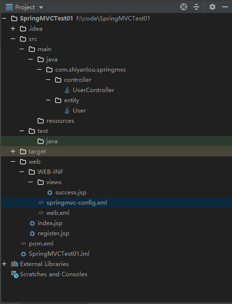
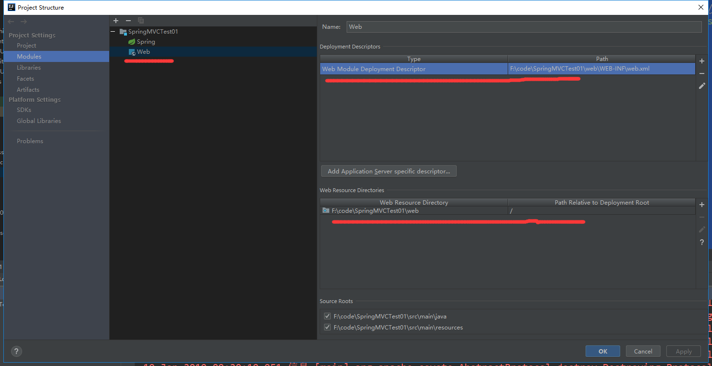
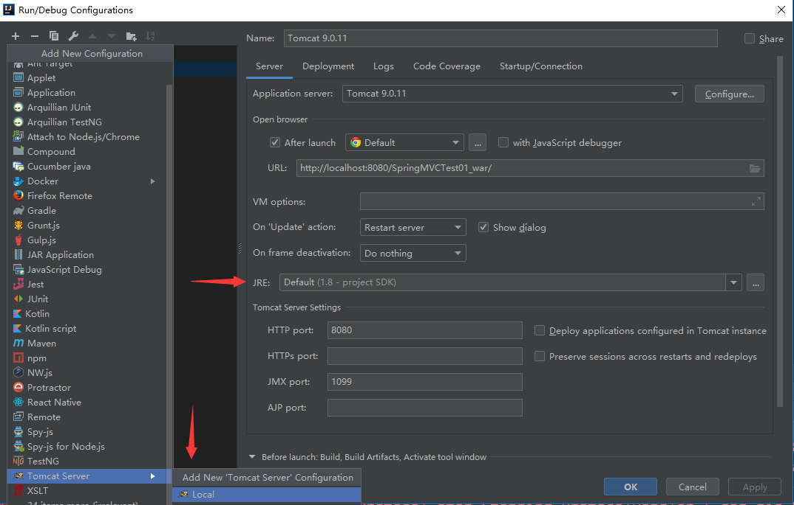
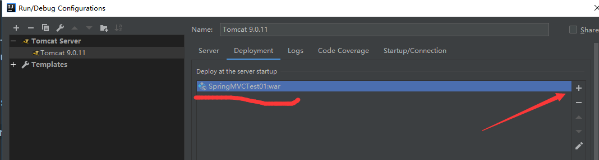
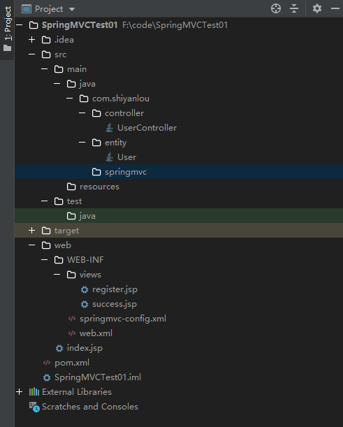

# SpringMVC

[TOC]

## first example

通过SpringMVC建立 基于 IDEA 的 web项目

idea + maven + SpringMVC

目录结构如下图



首先通过maven的pom.xml添加需要的库

pom.xml

```xml
<project xmlns="http://maven.apache.org/POM/4.0.0" xmlns:xsi="http://www.w3.org/2001/XMLSchema-instance"
         xsi:schemaLocation="http://maven.apache.org/POM/4.0.0 http://maven.apache.org/maven-v4_0_0.xsd">
    <modelVersion>4.0.0</modelVersion>
    <groupId>com.shiyanlou</groupId>
    <artifactId>SpringMVCTest01</artifactId>
    <packaging>war</packaging>
    <version>1.0-SNAPSHOT</version>
    <name>SpringMVCTest Maven Webapp</name>
    <url>http://maven.apache.org</url>

    <properties>
        <project.build.sourceEncoding>UTF-8</project.build.sourceEncoding>
        <spring.version>5.1.1.RELEASE</spring.version>
    </properties>

    <dependencies>
        <dependency>
            <groupId>org.springframework</groupId>
            <artifactId>spring-core</artifactId>
            <version>${spring.version}</version>
        </dependency>
        <dependency>
            <groupId>org.springframework</groupId>
            <artifactId>spring-beans</artifactId>
            <version>${spring.version}</version>
        </dependency>
        <dependency>
            <groupId>org.springframework</groupId>
            <artifactId>spring-context-support</artifactId>
            <version>${spring.version}</version>
        </dependency>
        <dependency>
            <groupId>org.springframework</groupId>
            <artifactId>spring-jdbc</artifactId>
            <version>${spring.version}</version>
        </dependency>
        <dependency>
            <groupId>org.springframework</groupId>
            <artifactId>spring-tx</artifactId>
            <version>${spring.version}</version>
        </dependency>
        <dependency>
            <groupId>org.springframework</groupId>
            <artifactId>spring-webmvc</artifactId>
            <version>${spring.version}</version>
        </dependency>

        <dependency>
            <groupId>javax.servlet</groupId>
            <artifactId>javax.servlet-api</artifactId>
            <version>3.1.0</version>
            <scope>provided</scope>
        </dependency>
        <dependency>
            <groupId>javax.servlet.jsp</groupId>
            <artifactId>jsp-api</artifactId>
            <version>2.2</version>
        </dependency>
        <dependency>
            <groupId>javax.servlet</groupId>
            <artifactId>jstl</artifactId>
            <version>1.2</version>
        </dependency>
    </dependencies>
    <build>
        <plugins>
            <plugin>
                <!--jetty maven插件，为maven提供运行web程序的能力-->
                <groupId>org.eclipse.jetty</groupId>
                <artifactId>jetty-maven-plugin</artifactId>
                <version>9.4.12.v20180830</version>
                <configuration>
                    <scanIntervalSeconds>10</scanIntervalSeconds>
                    <webApp>
                        <contextPath>/</contextPath>
                    </webApp>
                </configuration>
            </plugin>
        </plugins>
    </build>
</project>
```

2, 配置web.xml文件

```xml
<?xml version="1.0" encoding="UTF-8"?>
<web-app xmlns:xsi="http://www.w3.org/2001/XMLSchema-instance"
         xmlns="http://java.sun.com/xml/ns/javaee" xmlns:web="http://java.sun.com/xml/ns/javaee/web-app_2_5.xsd"
         xsi:schemaLocation="http://java.sun.com/xml/ns/javaee http://java.sun.com/xml/ns/javaee/web-app_3_0.xsd"
         id="WebApp_ID" version="3.0">
    <display-name>SpringMVCTest</display-name>

    <!-- 配置 Spring MVC DispatchcerServlet 前端控制器 -->
    <servlet>
        <servlet-name>springmvc</servlet-name>
        <servlet-class>org.springframework.web.servlet.DispatcherServlet</servlet-class>
        <init-param>
            <!-- contextConfigLocation 是参数名称，该参数的值包含 Spring MVC 的配置文件路径 -->
            <param-name>contextConfigLocation</param-name>
            <param-value>/WEB-INF/springmvc-config.xml</param-value>
        </init-param>
        <!-- 在 Web 应用启动时立即加载 Servlet -->
        <load-on-startup>1</load-on-startup>
    </servlet>
    <!-- Servlet 映射声明 -->
    <servlet-mapping>
        <servlet-name>springmvc</servlet-name>
        <!-- 监听当前域的所有请求 -->
        <url-pattern>/</url-pattern>
    </servlet-mapping>
    <!-- 添加 register.jsp 为首页 -->
    <welcome-file-list>
        <welcome-file>register.jsp</welcome-file>
    </welcome-file-list>
</web-app>
```

    在 web.xml 中配置了 DispatchcerServlet，DispatchcerServlet 加载时需要一个 Spring MVC 的配置文件，默认会去 WEB-INF 下查找对应的 [servlet-name]-servlet.xml 文件，如本例中默认查找的是 springmvc-servlet.xml。

    Spring MVC 的配置文件可以放在任何地方，用 servlet 的子元素 init-param 描述即可，见上述示例代码，这时 DispatchcerServlet 就会去查找 /WEB-INF/springmvc-config.xml。

如果 /WEB-INF/找不到，可能是web目录没有自动选定,在 File -> Project Structrure下选择一下



web.xml 链接了一个SpringMVC的配置文件springmvc-config.xml

```xml
<?xml version="1.0" encoding="UTF-8"?>
<beans xmlns="http://www.springframework.org/schema/beans"
       xmlns:xsi="http://www.w3.org/2001/XMLSchema-instance" xmlns:context="http://www.springframework.org/schema/context"
       xmlns:mvc="http://www.springframework.org/schema/mvc"
       xsi:schemaLocation="http://www.springframework.org/schema/beans http://www.springframework.org/schema/beans/spring-beans-4.2.xsd
        http://www.springframework.org/schema/context http://www.springframework.org/schema/context/spring-context-4.2.xsd
        http://www.springframework.org/schema/mvc http://www.springframework.org/schema/mvc/spring-mvc-4.2.xsd">

    <!-- 开启注解 -->
    <mvc:annotation-driven />
    <!-- 配置自动扫描的包，完成 Bean 的创建和自动依赖注入的功能 -->
    <context:component-scan base-package="com.shiyanlou.springmvc.controller" />
    <!-- 默认静态资源处理 -->
    <mvc:default-servlet-handler/>
    <!-- 配置视图解析器 -->
    <bean id="viewResolver" class="org.springframework.web.servlet.view.InternalResourceViewResolver">
        <property name="prefix" value="/WEB-INF/views/"></property>
        <property name="suffix" value=".jsp"></property>
    </bean>
</beans>
```

    上述配置文件中， Spring 使用了扫描机制查找应用程序所有基于注解的控制器类，在本例中，扫描的是 com.shiyanlou.springmvc.controller 包及其子包下的所有 Java 文件。

    最后配置的视图解析器 InternalResourceViewResolver 用来解析视图，将 View 呈现给用户。视图解析器中配置的 prefix表示视图的前缀， suffix表示视图的后缀。

实体类

```java
package com.shiyanlou.springmvc.entity;

import java.io.Serializable;

public class User implements Serializable {

    private static final long serialVersionUID = 1L;
    private Integer id;
    private String username;
    private String password;
    private Integer age;

    public Integer getId() {
        return id;
    }

    public void setId(Integer id) {
        this.id = id;
    }

    public String getUsername() {
        return username;
    }

    public void setUsername(String username) {
        this.username = username;
    }

    public String getPassword() {
        return password;
    }

    public void setPassword(String password) {
        this.password = password;
    }

    public Integer getAge() {
        return age;
    }

    public void setAge(Integer age) {
        this.age = age;
    }
}
```

```java
package com.shiyanlou.springmvc.controller;

import org.springframework.stereotype.Controller;
import org.springframework.ui.Model;
import org.springframework.web.bind.annotation.RequestMapping;

import com.shiyanlou.springmvc.entity.User;

/**
 * UserController 是一个基于注解的控制器
 * 可以同时处理多个请求动作
 */
@Controller
public class UserController {
    /**
     * RequestMapping 用来映射一个请求和请求的方法
     * value="/register" 表示请求由 register 方法进行处理
     */
    @RequestMapping(value="/register")
    public String Register(User user, Model model) {  // user:视图层传给控制层的表单对象；model：控制层返回给视图层的对象
        // 在 model 中添加一个名为 "user" 的 user 对象
        model.addAttribute("user", user);
        // 返回一个字符串 " success" 作为视图名称
        return "success";
    }
}
```

两个jsp文件

register.jsp

```jsp
<%@ page language="java" contentType="text/html; charset=UTF-8"
         pageEncoding="UTF-8"%>
<!DOCTYPE html PUBLIC "-//W3C//DTD HTML 4.01 Transitional//EN" "http://www.w3.org/TR/html4/loose.dtd">
<html>
<head>
    <meta http-equiv="Content-Type" content="text/html; charset=UTF-8">
    <title>register page</title>
</head>
<body>
<!-- 这里的register对应controller的@RequestMapping -->
<form action="register" method="post">
    <h5>User registration</h5>
    <p>
        <label>name </label> <input type="text" id="username" name="username"
                                    tabindex="1">
    </p>

    <p>
        <label>password </label> <input type="text" id="password" name="password"
                                        tabindex="2">
    </p>

    <p>
        <label>age </label> <input type="text" id="age" name="age"
                                   tabindex="3">
    </p>
    <p id="buttons">
        <input id="submit" type="submit" tabindex="4" value="register">
        <input id="reset" type="reset" tabindex="5" value="reset">
    </p>
</form>
</body>
</html>
```

success.jsp

```jsp
<%@ page language="java" contentType="text/html; charset=UTF-8"
         pageEncoding="UTF-8"%>
<!DOCTYPE html PUBLIC "-//W3C//DTD HTML 4.01 Transitional//EN" "http://www.w3.org/TR/html4/loose.dtd">
<html>
<head>
    <meta http-equiv="Content-Type" content="text/html; charset=UTF-8">
    <title>success page</title>
</head>
<body>
<h5>login was successful</h5>
<p>
    name：${requestScope.user.username}<br /> password：${requestScope.user.password}<br /> age：${requestScope.user.age}<br />
</p>
</body>
</html>
```

下面通过IDEA 的 tomcat开启测试

点击右上角的加号，配置如下




如果下方有提示需要创建artificat



然后即可运行

****

## 一些注解

### @Controller

在 Spring MVC 中，控制器 Controller 负责处理由 DispatcherServlet 分发的请求，它把用户请求的数据经过业务处理层处理之后封装成一个 Model，然后再把该 Model 返回给对应的 View 进行展示。

不使用注解的方式，需要在 Spring MVC 配置文件 springmvc-config.xml 中添加 Controller 类的 Bean 对象，如：

```xml
<bean class="com.shiyanlou.springmvc.controller.UserController"/>
```

使用 @Controller 注解的类不再需要继承特定的基类或实现特定的接口，并且可以同时处理多个请求动作。

配置文件写法：

首先在头文件引入 spring-context。

启动包扫描功能，添加类似如下的代码：

```xml
<context:component-scan base-package="com.shiyanlou.springmvc.controller" />
base-package 是指定要扫描的包及其子包。
```

### @RequestMapping

@RequestMapping 注解用来处理请求地址映射，指示 Spring 用哪个类或方法来处理请求动作。 @RequestMapping 可用于类或方法上。

当 @RequestMapping 用于类上时，表示类中的所有响应方法都被映射到 value 属性所指示的路径下，如：

```java
@Controller
@RequestMapping(value="/user")
public class UserController {
    @RequestMapping(value="/register")
    public String Register() { 
        return "register";
    }
}
```

在这里，相关路径均要加上 /user，Register() 映射的 URL 为：

```http
http://localhost:8080/user/register
```

若未用 @RequestMapping(value="/user") 注解类，该方法映射的 URL 为：

```http
http://localhost:8080/register
```

同样是上面的示例代码， @RequestMapping(value="/register") 映射一个请求和请求的方法，请求由 Register 方法进行处理。

**@RequestMapping的一些属性**

（1）value

指定请求的实际地址，即 value 属性将 URL 映射到方法上。

如下面的代码：

```java
@Controller
public class UserController {
    @RequestMapping(value="/register")
    public String Register() { 
        return "register";
    }
}
```
对应的 URL：

```http
http://localhost:8080/register
```

如果 @RequestMapping 只有唯一的属性，value 属性名可省略。

`@RequestMapping(value="/register")`

`@RequestMapping("/register")`

（2）method

指定请求的 method 类型，即该方法可以处理的 HTTP 请求方式，如 GET、POST 等。

`@RequestMapping("/register",method=RequestMethod.POST)`

注：如果未指定 method，则可以处理任意类型的 HTTP 请求。

（3）consumes

指定处理请求的提交内容类型（Content-Type），例如 application/json, text/html。

`@RequestMapping("/register",method=RequestMethod.POST,consumes="application/json")`

这里只处理 request Content-Type 为 application/json 的请求。

（4）produces

指定返回的内容类型，仅当 request 请求头中的(Accept)类型中包含该指定类型才返回。

`@RequestMapping("/register",method=RequestMethod.POST,produces="application/json")`

（5）params

指定 request 中必须包含某些参数值是，才让该方法处理。

`@RequestMapping("/register",method=RequestMethod.POST,params="myParam=myValue")`

这里只处理名为 "myParam"，值为 "myValue" 的请求。

（6）headers

指定 request 中必须包含某些指定的 header 值，才能让该方法处理请求。

`@RequestMapping("/register",method=RequestMethod.POST,headers="Referer=http://www.shiyanlou.com")`

这里只处理 request 的 header 中包含了指定 "Referer" 请求头和对应值为 "http://www.shiyanlou.com" 的请求。

****

## 数据绑定和校验总结

项目目录结构如下



maven配置如下

```xml
<project xmlns="http://maven.apache.org/POM/4.0.0" xmlns:xsi="http://www.w3.org/2001/XMLSchema-instance"
         xsi:schemaLocation="http://maven.apache.org/POM/4.0.0 http://maven.apache.org/maven-v4_0_0.xsd">
    <modelVersion>4.0.0</modelVersion>
    <groupId>com.shiyanlou</groupId>
    <artifactId>SpringMVCTest01</artifactId>
    <packaging>war</packaging>
    <version>1.0-SNAPSHOT</version>
    <name>SpringMVCTest Maven Webapp</name>
    <url>http://maven.apache.org</url>

    <properties>
        <project.build.sourceEncoding>UTF-8</project.build.sourceEncoding>
        <spring.version>5.1.1.RELEASE</spring.version>
    </properties>

    <dependencies>
        <dependency>
            <groupId>org.springframework</groupId>
            <artifactId>spring-core</artifactId>
            <version>${spring.version}</version>
        </dependency>
        <dependency>
            <groupId>org.springframework</groupId>
            <artifactId>spring-beans</artifactId>
            <version>${spring.version}</version>
        </dependency>
        <dependency>
            <groupId>org.springframework</groupId>
            <artifactId>spring-context-support</artifactId>
            <version>${spring.version}</version>
        </dependency>
        <dependency>
            <groupId>org.springframework</groupId>
            <artifactId>spring-jdbc</artifactId>
            <version>${spring.version}</version>
        </dependency>
        <dependency>
            <groupId>org.springframework</groupId>
            <artifactId>spring-tx</artifactId>
            <version>${spring.version}</version>
        </dependency>
        <dependency>
            <groupId>org.springframework</groupId>
            <artifactId>spring-webmvc</artifactId>
            <version>${spring.version}</version>
        </dependency>

        <dependency>
            <groupId>javax.servlet</groupId>
            <artifactId>javax.servlet-api</artifactId>
            <version>3.1.0</version>
            <scope>provided</scope>
        </dependency>
        <dependency>
            <groupId>javax.servlet.jsp</groupId>
            <artifactId>jsp-api</artifactId>
            <version>2.2</version>
        </dependency>
        <dependency>
            <groupId>javax.servlet</groupId>
            <artifactId>jstl</artifactId>
            <version>1.2</version>
        </dependency>

        <dependency>
            <groupId>org.hibernate.validator</groupId>
            <artifactId>hibernate-validator</artifactId>
            <version>6.0.13.Final</version>
        </dependency>

    </dependencies>
    <build>
        <plugins>
            <plugin>
                <!--jetty maven插件，为maven提供运行web程序的能力-->
                <groupId>org.eclipse.jetty</groupId>
                <artifactId>jetty-maven-plugin</artifactId>
                <version>9.4.12.v20180830</version>
                <configuration>
                    <scanIntervalSeconds>10</scanIntervalSeconds>
                    <webApp>
                        <contextPath>/</contextPath>
                    </webApp>
                </configuration>
            </plugin>
        </plugins>
    </build>
</project>
```

一个实体类，对应一个控制类

```java
package com.shiyanlou.entity;

import javax.validation.constraints.Pattern;

import javax.validation.constraints.Email;
import org.hibernate.validator.constraints.Length;
import javax.validation.constraints.NotBlank;
import org.hibernate.validator.constraints.Range;

public class User {

    //下面注解是校验部分
    @NotBlank(message = "Username can not be empty")
    private String username;
    @NotBlank(message = "password can not be blank")
    @Length(min = 6, max = 16, message = "The length of the password must be between 6 and 16 bits")
    private String password;
    @Range(min = 18, max = 60, message = "Age must be between 18 and 60 years old")
    private Integer age;
    @Pattern(regexp = "^1[3|4|5|7|8][0-9]{9}$", message = "Please enter the correct format of the phone number")
    private String phone;
    @Email(message = "Please enter a valid email address")
    private String email;

    public String getUsername() {
        return username;
    }

    public void setUsername(String username) {
        this.username = username;
    }

    public String getPassword() {
        return password;
    }

    public void setPassword(String password) {
        this.password = password;
    }

    public Integer getAge() {
        return age;
    }

    public void setAge(Integer age) {
        this.age = age;
    }

    public String getPhone() {
        return phone;
    }

    public void setPhone(String phone) {
        this.phone = phone;
    }

    public String getEmail() {
        return email;
    }

    public void setEmail(String email) {
        this.email = email;
    }

}
```

```java
package com.shiyanlou.controller;
import javax.validation.Valid;

import org.springframework.stereotype.Controller;
import org.springframework.ui.Model;
import org.springframework.validation.Errors;
import org.springframework.web.bind.annotation.ModelAttribute;
import org.springframework.web.bind.annotation.RequestMapping;

import com.shiyanlou.entity.User;

@Controller
public class UserController {

    // 进入注册页面
    @RequestMapping(value = "/registerform")
    public String registerform(Model model) {
        model.addAttribute("user", new User());
        return "register";
    }

    // 注册请求的响应方法
    @RequestMapping(value = "/register")
    public String register(@Valid  @ModelAttribute("user") User user, Errors errors,Model model) {
        if(errors.hasErrors()){
            return "register";
        }
        model.addAttribute("user", user);
        return "success";
    }
}

```

然后在web.xml中要配置 DispatcherServlet

```xml
<!-- 配置 Spring MVC DispatchcerServlet 前端控制器 -->
    <servlet>
        <servlet-name>springmvc</servlet-name>
        <servlet-class>org.springframework.web.servlet.DispatcherServlet</servlet-class>
        <init-param>
            <param-name>contextConfigLocation</param-name>
            <param-value>/WEB-INF/springmvc-config.xml</param-value>
        </init-param>
        <load-on-startup>1</load-on-startup>
    </servlet>
    <!-- Servlet 映射声明 -->
    <servlet-mapping>
        <servlet-name>springmvc</servlet-name>
        <url-pattern>/</url-pattern>
    </servlet-mapping>
```

完整web.xml

```xml
<?xml version="1.0" encoding="UTF-8"?>
<web-app xmlns:xsi="http://www.w3.org/2001/XMLSchema-instance" xmlns="http://java.sun.com/xml/ns/javaee" xmlns:web="http://java.sun.com/xml/ns/javaee/web-app_2_5.xsd" xsi:schemaLocation="http://java.sun.com/xml/ns/javaee http://java.sun.com/xml/ns/javaee/web-app_3_0.xsd" id="WebApp_ID" version="3.0">
    <display-name>BindAndValidatorTest</display-name>

    <!-- 配置 Spring MVC DispatchcerServlet 前端控制器 -->
    <servlet>
        <servlet-name>springmvc</servlet-name>
        <servlet-class>org.springframework.web.servlet.DispatcherServlet</servlet-class>
        <init-param>
            <param-name>contextConfigLocation</param-name>
            <param-value>/WEB-INF/springmvc-config.xml</param-value>
        </init-param>
        <load-on-startup>1</load-on-startup>
    </servlet>
    <!-- Servlet 映射声明 -->
    <servlet-mapping>
        <servlet-name>springmvc</servlet-name>
        <url-pattern>/</url-pattern>
    </servlet-mapping>
    <!-- 避免中文乱码 -->
    <filter>
        <filter-name>characterEncodingFilter</filter-name>
        <filter-class>org.springframework.web.filter.CharacterEncodingFilter</filter-class>
        <init-param>
            <param-name>encoding</param-name>
            <param-value>UTF-8</param-value>
        </init-param>
        <init-param>
            <param-name>forceEncoding</param-name>
            <param-value>true</param-value>
        </init-param>
    </filter>
    <filter-mapping>
        <filter-name>characterEncodingFilter</filter-name>
        <url-pattern>/*</url-pattern>
    </filter-mapping>
    <!-- 首页为 index.jsp-->
    <welcome-file-list>
        <welcome-file>index.jsp</welcome-file>
    </welcome-file-list>
</web-app>

```

springmvc-config.xml 配置控制器

```java
<?xml version="1.0" encoding="UTF-8"?>
<beans xmlns="http://www.springframework.org/schema/beans"
       xmlns:xsi="http://www.w3.org/2001/XMLSchema-instance" xmlns:p="http://www.springframework.org/schema/p"
       xmlns:mvc="http://www.springframework.org/schema/mvc" xmlns:context="http://www.springframework.org/schema/context"
       xmlns:aop="http://www.springframework.org/schema/aop"
       xsi:schemaLocation="http://www.springframework.org/schema/beans
        http://www.springframework.org/schema/beans/spring-beans-4.2.xsd
        http://www.springframework.org/schema/mvc
        http://www.springframework.org/schema/mvc/spring-mvc-4.2.xsd
        http://www.springframework.org/schema/context
        http://www.springframework.org/schema/context/spring-context-4.2.xsd
        http://www.springframework.org/schema/aop
        http://www.springframework.org/schema/aop/spring-aop-4.2.xsd">
    <context:component-scan base-package="com.shiyanlou.controller" />
    <mvc:annotation-driven />
    <bean id="viewResolver"
          class="org.springframework.web.servlet.view.InternalResourceViewResolver">
        <property name="prefix" value="/WEB-INF/views/" />
        <property name="suffix" value=".jsp" />
    </bean>
</beans>

```

步骤总结

在一个普通web项目下

web.xml下配置DispatchcerServlet，DispatchcerServlet 加载时需要一个 Spring MVC 的配置文件，默认会去 WEB-INF 下查找对应的 [servlet-name]-servlet.xml 文件

配置 Spring MVC 配置文件 springmvc-config.xml，配置 Spring MVC 的 Controller（一个类）


