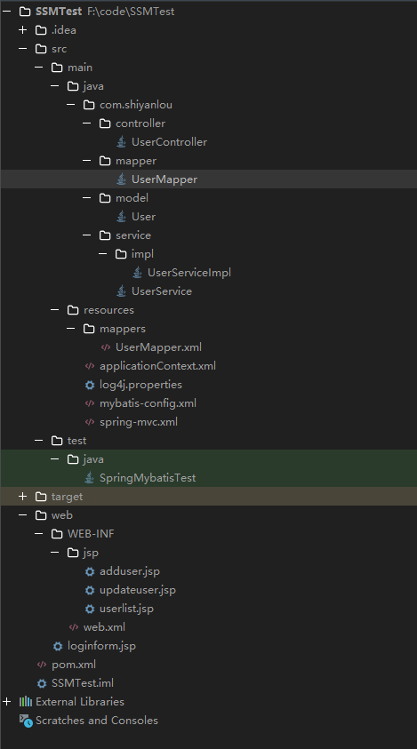
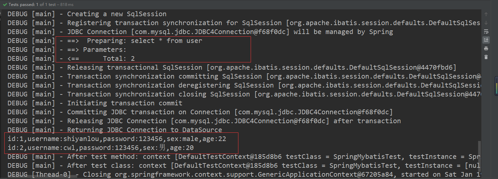
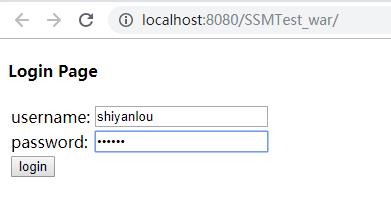
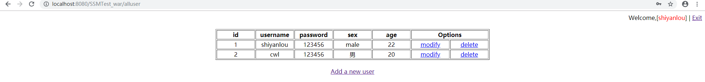

# SSM 整合笔记

[TOC]

## 一个用户登入的SSM框架案例

学习SSM整合前我首先单独学习了以下内容

1. 基于maven的项目管理
    
    maven是一个仓库，简单来说，我们需要依赖库的时候回去下载安装，但是maven实现了需要库的时候通过pom.xml的配置文件自动加载。首先会在本地有一个本地仓库，本地仓库没有回到远程仓库下载。代替了原本使用jar包的方式

2. Mybatis框架

    持久层，一个代替JDBC的部分，控制对于数据库的访问

3. Spring

    个人观点Spring的关键在于控制反转和面向切片编程。

    控制反转:创建一个类的时候，不自己创建而是去别人拿一个。通过xml配置javaBean可以减低代码的耦合性

    面向切片编程:一个函数执行的时候，劫持该函数，在函数执行前后做其他的事情

    Spring作为SSM框架的事务控制层

4. SpringMVC

    将业务处理完的数据进行显示的表现层


    Spring MVC 用于 Web 层，相当于 Controller，处理请求并作出响应；MyBatis 作为持久层的框架，可以自由的控制 SQL，更加简捷地完成数据库操作；Spring 的依赖注入可以减少代码的耦合，可以装配 Bean，另外其 AOP、事务管理尤其方便，同时，Spring 可以将各层进行整合。

首先，基于IDEA建立 maven项目，添加web依赖，这样项目将同时具备meaven和web的目录结构

目录结构如下:



### 通过pom.xml 先添加项目的依赖

```xml
<?xml version="1.0" encoding="UTF-8"?>
<project xmlns="http://maven.apache.org/POM/4.0.0"
         xmlns:xsi="http://www.w3.org/2001/XMLSchema-instance"
         xsi:schemaLocation="http://maven.apache.org/POM/4.0.0 http://maven.apache.org/xsd/maven-4.0.0.xsd">
    <modelVersion>4.0.0</modelVersion>

    <groupId>com.shiyanlou</groupId>
    <artifactId>SSMTest</artifactId>
    <version>1.0-SNAPSHOT</version>
    <packaging>war</packaging>

    <properties>
        <jdbc.driver.version>5.1.47</jdbc.driver.version>
        <mybatis.version>3.3.0</mybatis.version>
        <mybatis-spring.version>1.2.2</mybatis-spring.version>
        <spring.version>5.1.1.RELEASE</spring.version>
        <project.build.sourceEncoding>UTF-8</project.build.sourceEncoding>
    </properties>

    <dependencies>
        <dependency>
            <groupId>junit</groupId>
            <artifactId>junit</artifactId>
            <version>4.12</version>
            <scope>test</scope>
        </dependency>
        <dependency>
            <groupId>org.springframework</groupId>
            <artifactId>spring-test</artifactId>
            <version>${spring.version}</version>
            <scope>test</scope>
        </dependency>

        <!-- commons 包依赖 -->
        <dependency>
            <groupId>commons-logging</groupId>
            <artifactId>commons-logging</artifactId>
            <version>1.1.3</version>
        </dependency>
        <dependency>
            <groupId>commons-collections</groupId>
            <artifactId>commons-collections</artifactId>
            <version>3.2.1</version>
        </dependency>
        <dependency>
            <groupId>commons-io</groupId>
            <artifactId>commons-io</artifactId>
            <version>2.4</version>
        </dependency>
        <dependency>
            <groupId>commons-lang</groupId>
            <artifactId>commons-lang</artifactId>
            <version>2.6</version>
        </dependency>
        <!-- 数据库包依赖 -->
        <dependency>
            <groupId>org.mybatis</groupId>
            <artifactId>mybatis</artifactId>
            <version>${mybatis.version}</version>
        </dependency>
        <dependency>
            <groupId>org.mybatis</groupId>
            <artifactId>mybatis-spring</artifactId>
            <version>${mybatis-spring.version}</version>
        </dependency>
        <dependency>
            <groupId>mysql</groupId>
            <artifactId>mysql-connector-java</artifactId>
            <version>${jdbc.driver.version}</version>
            <scope>runtime</scope>
        </dependency>
        <!-- 日志包依赖 -->
        <dependency>
            <groupId>org.slf4j</groupId>
            <artifactId>slf4j-api</artifactId>
            <version>1.7.7</version>
        </dependency>
        <dependency>
            <groupId>org.slf4j</groupId>
            <artifactId>slf4j-log4j12</artifactId>
            <version>1.7.7</version>
            <exclusions>
                <exclusion>
                    <artifactId>log4j</artifactId>
                    <groupId>log4j</groupId>
                </exclusion>
            </exclusions>
        </dependency>
        <dependency>
            <groupId>log4j</groupId>
            <artifactId>log4j</artifactId>
            <version>1.2.16</version>
        </dependency>

        <!-- aspectj 包依赖 -->
        <dependency>
            <groupId>org.aspectj</groupId>
            <artifactId>aspectjrt</artifactId>
            <version>1.7.4</version>
        </dependency>
        <dependency>
            <groupId>org.aspectj</groupId>
            <artifactId>aspectjweaver</artifactId>
            <version>1.7.4</version>
        </dependency>

        <!-- Spring 依赖 -->
        <dependency>
            <groupId>org.springframework</groupId>
            <artifactId>spring-core</artifactId>
            <version>${spring.version}</version>
        </dependency>
        <dependency>
            <groupId>org.springframework</groupId>
            <artifactId>spring-beans</artifactId>
            <version>${spring.version}</version>
        </dependency>
        <dependency>
            <groupId>org.springframework</groupId>
            <artifactId>spring-context-support</artifactId>
            <version>${spring.version}</version>
        </dependency>
        <dependency>
            <groupId>org.springframework</groupId>
            <artifactId>spring-jdbc</artifactId>
            <version>${spring.version}</version>
        </dependency>
        <dependency>
            <groupId>org.springframework</groupId>
            <artifactId>spring-tx</artifactId>
            <version>${spring.version}</version>
        </dependency>
        <dependency>
            <groupId>org.springframework</groupId>
            <artifactId>spring-webmvc</artifactId>
            <version>${spring.version}</version>
        </dependency>

        <dependency>
            <groupId>javax.servlet</groupId>
            <artifactId>javax.servlet-api</artifactId>
            <version>3.1.0</version>
            <scope>provided</scope>
        </dependency>
        <dependency>
            <groupId>javax.servlet.jsp</groupId>
            <artifactId>jsp-api</artifactId>
            <version>2.2</version>
        </dependency>
        <dependency>
            <groupId>javax.servlet</groupId>
            <artifactId>jstl</artifactId>
            <version>1.2</version>
        </dependency>
    </dependencies>
    <build>
        <plugins>
            <plugin>
                <!--jetty maven插件，为maven提供运行web程序的能力-->
                <groupId>org.eclipse.jetty</groupId>
                <artifactId>jetty-maven-plugin</artifactId>
                <version>9.4.12.v20180830</version>
                <configuration>
                    <scanIntervalSeconds>10</scanIntervalSeconds>
                    <webApp>
                        <contextPath>/</contextPath>
                    </webApp>
                </configuration>
            </plugin>
        </plugins>
    </build>
</project>
```

### 创建数据库

```sql
create database ssm;

use ssm;
create table user(
    id int primary key auto_increment,
    username varchar(20),
    password varchar(20),
    sex varchar(10),
    age int
);

insert into user(username,password,sex,age) value('shiyanlou','123456','male',22);
```

### model层实体类

User.java

```java
package com.shiyanlou.model;

public class User {
    private Integer id;       // 用户 id
    private String username;  // 用户名
    private String password;  // 密码
    private String sex;       // 性别
    private Integer age;      // 年龄

    public Integer getId() {
        return id;
    }

    public void setId(Integer id) {
        this.id = id;
    }

    public String getUsername() {
        return username;
    }

    public void setUsername(String username) {
        this.username = username;
    }

    public String getPassword() {
        return password;
    }

    public void setPassword(String password) {
        this.password = password;
    }

    public String getSex() {
        return sex;
    }

    public void setSex(String sex) {
        this.sex = sex;
    }

    public Integer getAge() {
        return age;
    }

    public void setAge(Integer age) {
        this.age = age;
    }

    // 重写了 toString 方法，方便后面的测试
    public String toString() {
        return "id:" + id + ",username:" + username + ",password:" + password
                + ",sex:" + sex + ",age:" + age;

    }
}
```

### mapper(dao)层的实现

```java
package com.shiyanlou.mapper;

import com.shiyanlou.model.User;

import java.util.List;

public interface UserMapper {

    /**
     * 用户登录查询
     *
     * @param user
     * @return User
     **/
    User selectLogin(User user);

    /**
     * 查询全部用户
     *
     * @return List<User>
     **/
    List<User> selectAllUser();

    /**
     * 新增用户
     *
     * @param user
     **/
    void addUser(User user);

    /**
     * 更新用户
     *
     * @param user
     **/
    void updateUser(User user);

    /**
     * 删除用户
     *
     * @param id
     **/
    void deleteUser(Integer id);
}
```

UserMapper.xml

```xml
<?xml version="1.0" encoding="UTF-8"?>
<!DOCTYPE mapper PUBLIC "-//mybatis.org//DTD Mapper 3.0//EN"
        "http://mybatis.org/dtd/mybatis-3-mapper.dtd">
<mapper namespace="com.shiyanlou.mapper.UserMapper">
    <!-- 自定义结果集 -->
    <resultMap type="User" id="userResultMap">
        <id property="id" column="id"/>
        <result property="username" column="username"/>
        <result property="password" column="password"/>
        <result property="sex" column="sex"/>
        <result property="age" column="age"/>
    </resultMap>
    <!-- 登录查询 -->
    <select id="selectLogin" parameterType="User" resultMap="userResultMap">
        select *
        from user
        where username = #{username}
          and password = #{password}
    </select>
    <!-- 查询所有用户 -->
    <select id="selectAllUser" resultMap="userResultMap">
        select *
        from user
    </select>
    <!-- 新增用户 -->
    <insert id="addUser" useGeneratedKeys="true" keyProperty="id">
        insert into user (username, password, sex, age)
        values (#{username}, #{password}, #{sex}, #{age})
    </insert>
    <!-- 更新用户 -->
    <update id="updateUser" parameterType="User">
        update user
        set username = #{username},
            password = #{password},
            sex      = #{sex},
            age      = #{age}
        where id = #{id}
    </update>
    <!-- 删除用户 -->
    <delete id="deleteUser" parameterType="int">
        delete
        from user
        where id = #{id}
    </delete>

</mapper>
```

### service 层实现

Service接口的实现

UserService接口

```java
package com.shiyanlou.service;

import com.shiyanlou.model.User;

import java.util.List;

public interface UserService {

    /**
     * 用户登录
     *
     * @param user
     * @return 登录成功返回 User 对象，失败返回 null
     **/
    User login(User user);

    /**
     * 查询所有用户
     *
     * @return 查询到的所有 User 对象的 list
     **/
    List<User> selectAllUser();

    /**
     * 新增用户
     *
     * @param user
     **/
    void addUser(User user);

    /**
     * 更新用户
     *
     * @param user
     **/
    void updateUser(User user);

    /**
     * 删除用户
     *
     * @param id（用户 id）
     **/
    void deleteUser(Integer id);
}
```

UserService接口的实现

```java
package com.shiyanlou.service.impl;

import com.shiyanlou.mapper.UserMapper;
import com.shiyanlou.model.User;
import com.shiyanlou.service.UserService;
import org.springframework.beans.factory.annotation.Autowired;
import org.springframework.stereotype.Service;
import org.springframework.transaction.annotation.Transactional;

import java.util.List;

/**
 * 将当前类注释为一个 Spring 的 bean
 *
 * @author shiyanlou
 */
@Service
@Transactional(rollbackFor = Exception.class)
public class UserServiceImpl implements UserService {
    /**
     * 自动注入 UserMapper
     **/
    @Autowired
    public UserMapper userMapper;

    // 下面是 UserService 接口所有方法的具体实现
    public User login(User user) {
        return userMapper.selectLogin(user);
    }

    public List<User> selectAllUser() {
        return userMapper.selectAllUser();
    }

    public void addUser(User user) {
        userMapper.addUser(user);
    }

    public void updateUser(User user) {
        userMapper.updateUser(user);
    }

    public void deleteUser(Integer id) {
        userMapper.deleteUser(id);
    }
}
```

### Spring 和 Mybatis 的整合

```xml
<!-- mybatis-config.xml -->
<?xml version="1.0" encoding="UTF-8"?>
<!DOCTYPE configuration PUBLIC "-//mybatis.org//DTD Config 3.0//EN" 
"http://mybatis.org/dtd/mybatis-3-config.dtd">
<configuration>
    <!-- 为JavaBean起类别名 -->
    <typeAliases>
        <package name="com.shiyanlou.model" />
    </typeAliases> 
    <!-- 通过 mapper 接口包加载整个包的映射文件 --> 
    <mappers>
        <package name="com.shiyanlou.mapper" />
    </mappers>
</configuration>
```

```xml
<!-- applicationContext.xml -->
<?xml version="1.0" encoding="UTF-8"?>
<beans xmlns="http://www.springframework.org/schema/beans"
       xmlns:xsi="http://www.w3.org/2001/XMLSchema-instance"
       xmlns:context="http://www.springframework.org/schema/context" xmlns:tx="http://www.springframework.org/schema/tx"
       xsi:schemaLocation="
          http://www.springframework.org/schema/beans
          http://www.springframework.org/schema/beans/spring-beans-4.2.xsd
          http://www.springframework.org/schema/context
          http://www.springframework.org/schema/context/spring-context-4.2.xsd
          http://www.springframework.org/schema/tx
          http://www.springframework.org/schema/tx/spring-tx-4.2.xsd">

    <!-- 自动扫描有 Spring 相关注解的类，并把这些类注册为 bean -->
    <context:component-scan base-package="com.shiyanlou" />
    <!-- 配置数据源 -->
    <bean id="dataSource"
        class="org.springframework.jdbc.datasource.DriverManagerDataSource">
        <property name="driverClassName" value="com.mysql.jdbc.Driver" />
        <property name="url" value="jdbc:mysql://localhost:3306/ssm" />
        <property name="username" value="root" />
        <property name="password" value="" />
    </bean>
    <!-- MyBatis 的 SqlSession 的工厂，并引用数据源，扫描 MyBatis 的配置文件 -->
    <bean id="sqlSessionFactory" class="org.mybatis.spring.SqlSessionFactoryBean">
        <property name="dataSource" ref="dataSource"/>
        <property name="configLocation" value="classpath:mybatis-config.xml" />
        <property name="mapperLocations" value="classpath*:mappers/**"/>
    </bean>

    <!-- MyBatis 自动扫描加载 Sql 映射文件/接口 -->
    <bean class="org.mybatis.spring.mapper.MapperScannerConfigurer">
        <property name="basePackage" value="com.shiyanlou.mapper"/>
        <property name="sqlSessionFactoryBeanName" value="sqlSessionFactory"/>
    </bean>
    <!-- JDBC 事务管理器 -->
    <bean id="txManager"
        class="org.springframework.jdbc.datasource.DataSourceTransactionManager">
        <property name="dataSource" ref="dataSource"/>
    </bean>
    <!-- 启用支持 annotation 注解方式事务管理 -->
    <tx:annotation-driven transaction-manager="txManager" />

</beans>
```

### 日志的配置

```xml
//log4j.properties
# Global logging configuration
log4j.rootLogger=DEBUG, stdout
# Console output...
log4j.appender.stdout=org.apache.log4j.ConsoleAppender
log4j.appender.stdout.layout=org.apache.log4j.PatternLayout
log4j.appender.stdout.layout.ConversionPattern=%5p [%t] - %m%n
```

### spring 和 mybatis 的整合测试 基于 Junit

```java
import com.shiyanlou.model.User;
import com.shiyanlou.service.UserService;
import org.junit.Test;
import org.junit.runner.RunWith;
import org.springframework.beans.factory.annotation.Autowired;
import org.springframework.test.context.ContextConfiguration;
import org.springframework.test.context.junit4.SpringJUnit4ClassRunner;

import java.util.List;

/**
 * 配置spring和junit整合，junit启动时加载springIOC容器 spring-test,junit
 **/
@RunWith(SpringJUnit4ClassRunner.class)
// 告诉junit spring配置文件
@ContextConfiguration({"classpath:applicationContext.xml"})
public class SpringMybatisTest {
    @Autowired
    private UserService userService;

/*    @Autowired
    private User user;*/

/*    @Test
    public void testLogin() {
        //User user = new User();
        user.setUsername("shiyanlou");
        user.setPassword("123456");
        System.out.println(userService.login(user).toString());

    }*/

    @Test
    public void testSelectAllUser() {
        List<User> users = userService.selectAllUser();
        for (User us : users) {
            System.out.println(us.toString());
        }
    }

/*    @Test
    public void testAdd() {
        //User user = new User();
        user.setUsername("user2");
        user.setPassword("123456");
        user.setSex("female");
        user.setAge(25);
        userService.addUser(user);
    }

    @Test
    public void testUpdate() {
        //User user = new User();
        user.setId(3);
        user.setUsername("user2");
        user.setPassword("123");
        user.setSex("female");
        user.setAge(30);
        userService.updateUser(user);
    }

    @Test
    public void testUpdate() {
        int id = 3;
        userService.deleteUser(id);
    }*/

}
```

如果测试成功会看到下面的结果, 可以继续下一步



### Controller 层实现

UserController.java

```java
package com.shiyanlou.controller;

import com.shiyanlou.model.User;
import com.shiyanlou.service.UserService;
import org.apache.ibatis.annotations.Param;
import org.springframework.beans.factory.annotation.Autowired;
import org.springframework.stereotype.Controller;
import org.springframework.ui.Model;
import org.springframework.web.bind.annotation.RequestMapping;

import javax.servlet.http.HttpServletRequest;
import javax.servlet.http.HttpSession;
import java.util.List;

/**
 * 处理用户请求 Controller
 **/
@Controller
public class UserController {

    /**
     * 自动注入 UserService
     **/
    @Autowired
    private UserService userService;

    // 登录
    @RequestMapping("/login")
    public String login(User user, Model model, HttpSession session) {
        User loginUser = userService.login(user);

        if (loginUser != null) {
            session.setAttribute("user", loginUser);
            return "redirect:alluser";
        } else {
            session.setAttribute("message", "username or password is wrong!");
            return "redirect:loginform.jsp";
        }
    }

    // 退出
    @RequestMapping(value = "/loginout")
    public String loginout(HttpSession session) {
        session.invalidate();
        return "redirect:loginform.jsp";
    }

    // 查询所有用户
    @RequestMapping("/alluser")
    public String selectAllUser(HttpServletRequest request) {
        List<User> listUser = userService.selectAllUser();
        request.setAttribute("listUser", listUser);
        return "userlist";
    }

    // 跳转至新增用户页面
    @RequestMapping("/toadduser")
    public String toAddUserPage() {
        return "adduser";
    }

    // 新增用户    
    @RequestMapping("/adduser")
    public String addUser(User user, HttpServletRequest request) {
        userService.addUser(user);
        List<User> listUser = userService.selectAllUser();
        request.setAttribute("listUser", listUser);
        return "userlist";
    }

    // 跳转至更新用户页面
    @RequestMapping("/toupdateuser")
    public String toUpdateUser(@Param("id") Integer id,
                               HttpServletRequest request, Model model) {
        model.addAttribute("user_id", id);
        return "updateuser";
    }

    // 更新用户
    @RequestMapping("/updateuser")
    public String updateUser(User user, HttpServletRequest request) {
        userService.updateUser(user);
        List<User> listUser = userService.selectAllUser();
        request.setAttribute("listUser", listUser);
        return "userlist";
    }

    // 删除用户
    @RequestMapping("/deleteuser")
    public String deleteUser(@Param("id") Integer id, HttpServletRequest request) {
        userService.deleteUser(id);
        List<User> listUser = userService.selectAllUser();
        request.setAttribute("listUser", listUser);
        return "userlist";
    }
}
```
### 一些可供测试的jsp文件

```jsp
<!-- loginform.jsp -->
<%@ page language="java" contentType="text/html; charset=UTF-8"
    pageEncoding="UTF-8"%>
<!DOCTYPE html PUBLIC "-//W3C//DTD HTML 4.01 Transitional//EN" "http://www.w3.org/TR/html4/loose.dtd">
<html>
<head>
<meta http-equiv="Content-Type" content="text/html; charset=UTF-8">
<title>Login Page</title>
</head>
<body>
    <h4>Login Page</h4>
    <form action="login" method="post">
    <font color="red">${sessionScope.message}</font>
        <table>
            <tr>
                <td><label>username:</label></td>
                <td><input type="text" id="username" name="username" />
            </tr>
            <tr>
                <td><label>password:</label></td>
                <td><input type="password" id="password" name="password" />
            </tr>
            <tr>
                <td><input type="submit" value="login" />
            </tr>
        </table>
    </form>
</body>
</html>
```

```jsp
<!-- userlist.jsp -->
<%@ page language="java" import="java.util.*" pageEncoding="utf-8"%>
<%@ taglib uri="http://java.sun.com/jsp/jstl/core" prefix="c"%>
<!DOCTYPE HTML PUBLIC "-//W3C//DTD HTML 4.01 Transitional//EN">
<html>
<head>
<title>ssm</title>
<style type="text/css">
td {
    text-align: center;
    width: 100px;
}
</style>
</head>

<body>
    <div align="right">
        Welcome,[<font color=red>${sessionScope.user.username}</font>] | <a
            href="loginout">Exit</a>
    </div>
    <br>
    <center>
        <table border="1">
            <tbody>
                <tr>
                    <th>id</th>
                    <th>username</th>
                    <th>password</th>
                    <th>sex</th>
                    <th>age</th>
                    <th colspan="2" style="">Options</th>
                </tr>
                <c:if test="${!empty listUser }">
                    <c:forEach items="${listUser}" var="user">
                        <tr>
                            <td>${user.id}</td>
                            <td>${user.username}</td>
                            <td>${user.password}</td>
                            <td>${user.sex}</td>
                            <td>${user.age}</td>
                            <td><a href="toupdateuser?id=${user.id}">modify</a></td>
                            <td><a href="deleteuser?id=${user.id}">delete</a></td>
                        </tr>
                    </c:forEach>
                </c:if>
            </tbody>
        </table>
        <br>
        <a href="toadduser">Add a new user</a>
    </center>
</body>
</html>
```

```jsp
<!-- adduser.jsp -->
<%@ page language="java" contentType="text/html; charset=UTF-8"
    pageEncoding="UTF-8"%>
<!DOCTYPE html PUBLIC "-//W3C//DTD HTML 4.01 Transitional//EN" "http://www.w3.org/TR/html4/loose.dtd">
<html>
<head>
<meta http-equiv="Content-Type" content="text/html; charset=UTF-8">
<title>Add Page</title>
</head>
<body>
    <h4>AddUser Page</h4>
    <form action="adduser" method="post">
        <table>
            <tr>
                <td><label>username:</label></td>
                <td><input type="text" id="username" name="username" />
            </tr>
            <tr>
                <td><label>password:</label></td>
                <td><input type="password" id="password" name="password" />
            </tr>
            <tr>
                <td><label>sex:</label></td>
                <td><input type="text" id="sex" name="sex" />
            </tr>
            <tr>
                <td><label>age:</label></td>
                <td><input type="text" id="age" name="age" />
            </tr>
            <tr>
                <td><input type="submit" value="add" />
            </tr>
        </table>
    </form>
</body>
</html>
```

```jsp
<!-- updateuser.jsp -->
<%@ page language="java" contentType="text/html; charset=UTF-8"
    pageEncoding="UTF-8"%>
<!DOCTYPE html PUBLIC "-//W3C//DTD HTML 4.01 Transitional//EN" "http://www.w3.org/TR/html4/loose.dtd">
<html>
<head>
<meta http-equiv="Content-Type" content="text/html; charset=UTF-8">
<title>Modify Page</title>
</head>
<body>
    <h4>Modify Page</h4>
    <form action="updateuser" method="post">
        <table>
            <tr>
                <td><label>id:</label></td>
                <td><input type="text" id="id" name="id" value="${user_id}" readonly="readonly"/>
            </tr>
            <tr>
                <td><label>username:</label></td>
                <td><input type="text" id="username" name="username" />
            </tr>
            <tr>
                <td><label>password:</label></td>
                <td><input type="password" id="password" name="password" />
            </tr>
            <tr>
                <td><label>sex:</label></td>
                <td><input type="text" id="sex" name="sex" />
            </tr>
            <tr>
                <td><label>age:</label></td>
                <td><input type="text" id="age" name="age" />
            </tr>
            <tr>
                <td><input type="submit" value="modify" />
            </tr>
        </table>
    </form>
</body>
</html>
```

### 配置 spring-mvc.xml 文件

```xml
<!-- spring-mvc.xml -->
<?xml version="1.0" encoding="UTF-8"?>
<beans xmlns="http://www.springframework.org/schema/beans"
       xmlns:xsi="http://www.w3.org/2001/XMLSchema-instance"
       xmlns:context="http://www.springframework.org/schema/context"
       xmlns:mvc="http://www.springframework.org/schema/mvc" xmlns:mvn="http://www.springframework.org/schema/mvc"
       xsi:schemaLocation="http://www.springframework.org/schema/beans
      http://www.springframework.org/schema/beans/spring-beans.xsd
      http://www.springframework.org/schema/context
      http://www.springframework.org/schema/context/spring-context-4.2.xsd
      http://www.springframework.org/schema/mvc
     http://www.springframework.org/schema/mvc/spring-mvc-4.2.xsd">

    <mvn:default-servlet-handler/>
    <!-- 自动扫描该包，Spring MVC 会将包下用 @Controller 注解的类注册为 Spring 的 controller -->
    <context:component-scan base-package="com.shiyanlou.controller" />
    <!-- 设置默认配置方案 -->
    <mvc:annotation-driven />
    <!-- 视图解析器 -->
    <bean id="viewResolver"
        class="org.springframework.web.servlet.view.InternalResourceViewResolver">
        <property name="prefix" value="/WEB-INF/jsp/" />
        <property name="suffix" value=".jsp" />
    </bean>
</beans>
```

### 配置 web.xml

```xml
<!-- web.xml -->
<?xml version="1.0" encoding="UTF-8"?>
<web-app xmlns="http://xmlns.jcp.org/xml/ns/javaee"
         xmlns:xsi="http://www.w3.org/2001/XMLSchema-instance"
         xsi:schemaLocation="http://xmlns.jcp.org/xml/ns/javaee http://xmlns.jcp.org/xml/ns/javaee/web-app_4_0.xsd"
         version="4.0">
    <display-name>SSMTest</display-name>

    <!-- 配置 Spring 核心监听器 -->
    <listener>
        <listener-class>org.springframework.web.context.ContextLoaderListener</listener-class>
    </listener>

    <!-- 指定 Spring 的配置文件 -->
    <context-param>
        <param-name>contextConfigLocation</param-name>
        <param-value>classpath:applicationContext.xml</param-value>
    </context-param>

    <!-- 定义 Spring MVC 前端控制器 -->
    <servlet>
        <servlet-name>springMVC</servlet-name>
        <servlet-class>org.springframework.web.servlet.DispatcherServlet</servlet-class>

        <init-param>
            <param-name>contextConfigLocation</param-name>
            <param-value>classpath:spring-mvc.xml</param-value>
        </init-param>
        <load-on-startup>1</load-on-startup>
    </servlet>

    <!-- 为 DispatcherServlet 建立映射 -->
    <servlet-mapping>
        <servlet-name>springMVC</servlet-name>
        <url-pattern>/</url-pattern>
    </servlet-mapping>
    <listener>
        <listener-class>org.springframework.web.util.IntrospectorCleanupListener</listener-class>
    </listener>

    <!-- 编码过滤器 -->
    <filter>
        <filter-name>encodingFilter</filter-name>
        <filter-class>org.springframework.web.filter.CharacterEncodingFilter</filter-class>
        <init-param>
            <param-name>encoding</param-name>
            <param-value>UTF-8</param-value>
        </init-param>
        <init-param>
            <param-name>forceEncoding</param-name>
            <param-value>true</param-value>
        </init-param>
    </filter>

    <filter-mapping>
        <filter-name>encodingFilter</filter-name>
        <url-pattern>/*</url-pattern>
    </filter-mapping>

    <!-- 设置首页 -->
    <welcome-file-list>
        <welcome-file>loginform.jsp</welcome-file>
    </welcome-file-list>
</web-app>
```

## 一些分析

### 结果





### Junit 测试 Spring 和 Mybatis 分析

```java
    @Test
    public void testSelectAllUser() {
        List<User> users = userService.selectAllUser();
        for (User us : users) {
            System.out.println(us.toString());
        }
    }
```

testSelectAllUser提出需求需要所有用户,去找service服务层一个实现了用户服务接口的类的函数


```java
package com.shiyanlou.service.impl;

/**
 * 将当前类注释为一个 Spring 的 bean
 *
 * @author shiyanlou
 */
@Service
@Transactional(rollbackFor = Exception.class)
public class UserServiceImpl implements UserService {
    /**
     * 自动注入 UserMapper
     **/
    @Autowired
    public UserMapper userMapper;

    // . . .

    public List<User> selectAllUser() {
        return userMapper.selectAllUser();
    }

    // . . .
}

```

这个函数通过userMapper的selectAllUser()函数进行操作

userMapper是一个接口，通过Spring自动生成的javaBean调用mybatis的配置获取数据。

```xml
    <!-- UserMapper.xml -->
    <resultMap type="User" id="userResultMap">
        <id property="id" column="id"/>
        <result property="username" column="username"/>
        <result property="password" column="password"/>
        <result property="sex" column="sex"/>
        <result property="age" column="age"/>
    </resultMap>
    
    <!-- 查询所有用户 -->
    <select id="selectAllUser" resultMap="userResultMap">
        select *
        from user
    </select>
```

### form 表单递交

```html
<form action="login" method="post">
```

action login 被 web.xml 中

```xml
    <!-- 定义 Spring MVC 前端控制器 -->
    <servlet>
        <servlet-name>springMVC</servlet-name>
        <servlet-class>org.springframework.web.servlet.DispatcherServlet</servlet-class>

        <init-param>
            <param-name>contextConfigLocation</param-name>
            <param-value>classpath:spring-mvc.xml</param-value>
        </init-param>
        <load-on-startup>1</load-on-startup>
    </servlet>
    <!-- 为 DispatcherServlet 建立映射 -->
    <servlet-mapping>
        <servlet-name>springMVC</servlet-name>
        <url-pattern>/</url-pattern>
    </servlet-mapping>
    <listener>
        <listener-class>org.springframework.web.util.IntrospectorCleanupListener</listener-class>
    </listener>
```

拦截，交给SpringMVC处理， 这里即spring-mvc.xml

在spring-mvc中设置控制类, 在这里控制业务

`User loginUser = userService.login(user);`

控制spring -> mybatis 获取数据

```java
package com.shiyanlou.controller;

/**
 * 处理用户请求 Controller
 **/
@Controller
public class UserController {

    /**
     * 自动注入 UserService
     **/
    @Autowired
    private UserService userService;

    // 登录
    @RequestMapping("/login")
    public String login(User user, Model model, HttpSession session) {
        User loginUser = userService.login(user);

        if (loginUser != null) {
            session.setAttribute("user", loginUser);
            return "redirect:alluser";
        } else {
            session.setAttribute("message", "username or password is wrong!");
            return "redirect:loginform.jsp";
        }
    }

}
```


