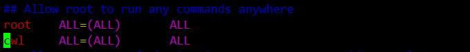

# CentenOS 搭建Web服务

[TOC]

## 服务器配置

    阿里云CentenOS

```bash
sudo useradd cwl //创建用户
passwd cwl  //修改用户密码
```

然后我们需要给cwl sudo权限

    /etc/sudoers 文件写着用户权限，默认只读我们需要修改权限

```
cd /etc
chmod u+w sudoers
```

使用vim修改成如下样式，第二行是我写的，注意貌似要用tab隔开



```
最后我们把权限改为只读
chmod u+w sudoers
```

## Tomcat服务器搭建

在 **/usr/local/java** 目录下安装java, java目录是自己建的， 和 **/usr/local/tomcat**, 把下载的压缩包丢进去

### 解压文件

```
```tar -xzvf [包名]
```

### 设置环境变量

jdk路径为: /usr/local/java/jdk1.8.0_201

在 /etc/profile.d/ 下 创建 java.sh

```bash
export JAVA_HOME=/usr/local/java/jdk1.8.0_201
export CLASS_PATH="$JAVA_HOME/lib:$JAVA_HOME/jre/lib"
export PATH=$PATH:$JAVA_HOME/bin
```

运行sh脚本使他生效
source /etc/profile.d/java.sh

java -version查看是否成功

```
java version "1.8.0_201"
Java(TM) SE Runtime Environment (build 1.8.0_201-b09)
Java HotSpot(TM) 64-Bit Server VM (build 25.201-b09, mixed mode)
```

tomcat变量

tomcat目录下bin的上一级路径为

/usr/local/tomcat/apache-tomcat-9.0.14

写入和刚刚java.sh同一目录下的tomcat.sh脚本，然后source

```
CATALINA_BASE=/usr/local/tomcat/apache-tomcat-9.0.14
PATH=$CATALINA_BASE/bin:$PATH
export PATH CATALINA_BASE
```

